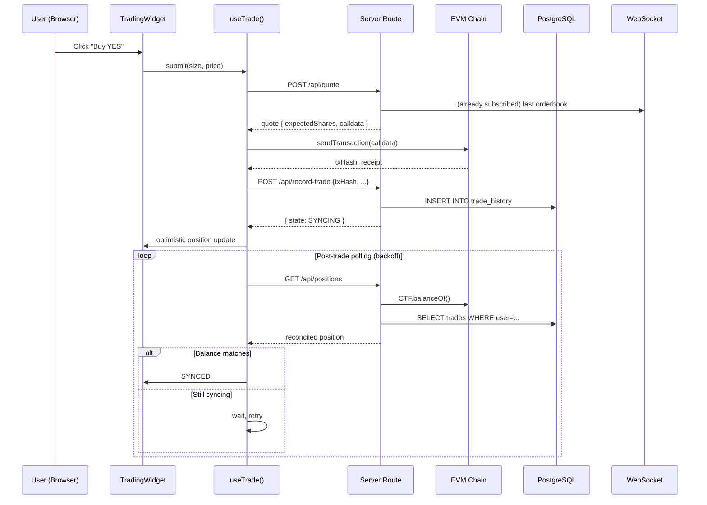
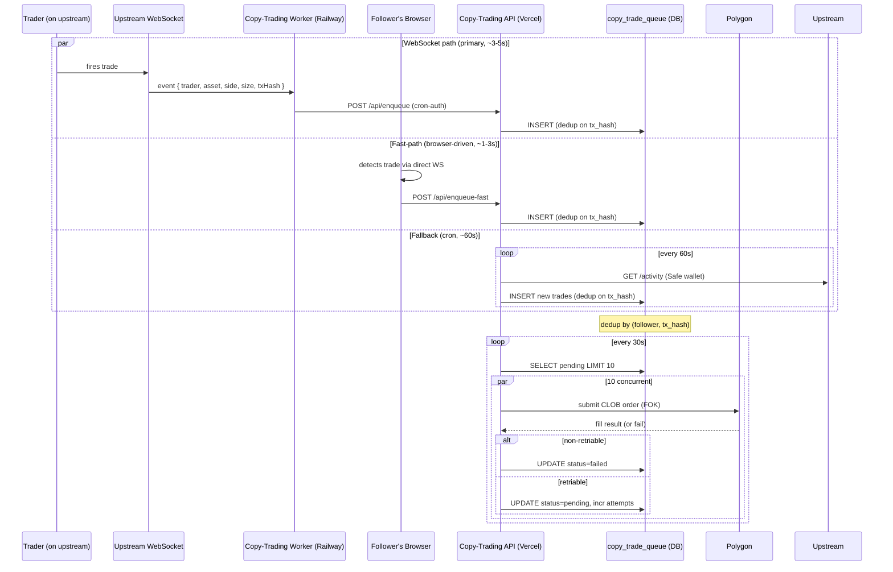

# System Architecture — Detailed Documentation

> Scope: architectural view of the integrations I designed and built.
> The broader product has additional components not covered here (auth, landing pages, marketing), which were outside my delivery scope.

## Table of Contents

- [System Overview](#system-overview)
- [Layer Breakdown](#layer-breakdown)
- [Data Flow: Trade Lifecycle](#data-flow-trade-lifecycle)
- [Data Flow: Copy-Trading Pipeline](#data-flow-copy-trading-pipeline)
- [Auth Architectures](#auth-architectures)
- [On-Chain Position Reconciliation](#on-chain-position-reconciliation)
- [Caching & Invalidation](#caching--invalidation)
- [Error Handling & Resilience](#error-handling--resilience)
- [Deployment Topology](#deployment-topology)

---

## System Overview

The product is a **multi-platform prediction-market aggregator**. Three integrations I shipped plug into it as peer modules, all exposing a common internal contract:

```
┌───────────────────────────────────────────────────────────────────────┐
│                       Unified Explore / Portfolio UI                   │
│  (platform-agnostic event cards, position rows, trade-history tables)  │
└───────────────────────────┬───────────────────────────────────────────┘
                            │
         ┌──────────────────┼──────────────────┬────────────────────┐
         │                  │                  │                    │
         ▼                  ▼                  ▼                    ▼
┌────────────────┐ ┌─────────────────┐ ┌──────────────────┐ ┌──────────────┐
│  Protocol A    │ │   Protocol B    │ │  Protocol C      │ │  Copy-Trading│
│  Integration   │ │   Integration   │ │  (upstream only) │ │    Module    │
│                │ │                 │ │                  │ │              │
│ BSC binary-opt │ │ CLOB+AMM hybrid │ │ Order-book       │ │ WS worker    │
│ + candle mkts  │ │ + HMAC auth     │ │ (Data API)       │ │ + FIFO PnL   │
└────────────────┘ └─────────────────┘ └──────────────────┘ └──────────────┘
         │                  │                                     │
         └──────────────────┴────────────┬────────────────────────┘
                                         │
                            ┌────────────▼────────────┐
                            │  Shared Primitives      │
                            │                         │
                            │  - PlatformIcon / name  │
                            │  - Normalizer protocol  │
                            │  - Position state FSM   │
                            │  - Trade-history DB     │
                            │  - On-chain CTF balance │
                            │  - Bridge / i18n config │
                            │  - Sentry helpers       │
                            └─────────────────────────┘
```

Each integration implements the same internal interfaces:

- **API client** — typed wrapper over the upstream's HTTP/WS endpoints
- **Normalizer** — maps upstream's response shape to internal `Platform*` types
- **Trade hook** — `useTrade()` returning `quote`, `execute`, `cancel`, `state`
- **Position source** — contributes to the unified portfolio view
- **Bridge config** — declares chain + collateral for deposit/withdraw flows
- **Lifecycle events** — emits market-resolved, position-closed, redeem-ready

---

## Layer Breakdown

### 1. UI Layer (`src/components/`, `src/app/(pages)/`)

- Next.js 16 App Router with Server Components where data is static, Client Components where interactivity is required
- shadcn/ui primitives (button, dialog, tabs, popover) as the foundation
- Tailwind CSS 4 with a custom brand-color palette
- i18n via `next-intl` — all UI strings keyed, three locales (en/ko/zh)
- Key components I built or materially extended:
  - `TradingWidget` — buy/sell with platform-specific branches
  - `PositionsPanel` — cross-platform position aggregation
  - `OrderBookPanel` — live WS-driven orderbook (Protocol B)
  - `LimitOrderDialog` — price input, locked-balance display, cancel
  - `TradeHistoryTable` — unified across platforms, with tx-hash deduplication
  - `FundWalletSecurityDialog` — security-first copy-trading onboarding

### 2. State Layer (`src/stores/`, `src/providers/`)

- **Zustand stores** for UI-local state (active platform filter, selected market, just-closed token IDs)
- **TanStack Query** for server state (quotes, positions, portfolio, order book)
  - Query-key convention: `['platform', 'resource', ...params]`
  - Invalidation: per-resource, with surgical partial-tree invalidation after actions
  - Background refetch: tuned per resource (10s for live crypto, 30s for standard markets)
- **Context providers** for wallet (`wagmi`), signer (Account Kit), user session

### 3. Data-Fetching Layer (`src/hooks/`, `src/app/api/`)

- Custom hooks encapsulate each integration's "read" API:
  - `useMyriadPositions`, `useMyriadPrice`, `useMyriadTrade`
  - `useLimitlessOrderbook`, `useLimitlessOpenOrders`, `useLimitlessPositions`
  - `useCopyTradingExposure`, `useCopyTradingHistory`
- API routes at `src/app/api/` proxy sensitive calls server-side:
  - API-key masking (upstream protocols)
  - HMAC signing of Protocol B requests
  - Stamped-request validation before DB writes
  - `captureApiError` with category/tags for Sentry

### 4. Web3 Layer (`src/hooks/web3/`, utilities)

- **Reads:** viem public clients per chain, shared pool
- **Writes:** wagmi walletClient for EOA flows, Account Kit smart-wallet client for AA flows
- **RelayClient:** gas-sponsored Safe transactions (redeem, withdraw)
- **Balance reconciliation:** on-chain CTF `balanceOf(conditionId)` as the source of truth for open positions, cross-checked against trade-history DB

### 5. Persistence Layer (`src/lib/db/`)

- PostgreSQL via Drizzle ORM, typed schema
- Key tables I designed or extended:
  - `users` — with `isPhantom` flag for external-wallet copy-trading targets
  - `copy_trade_queue` — with `actual_sell_value`, unique constraint on `(follower_id, tx_hash)`
  - `trade_history` — unified across platforms, PnL metadata
  - `notifications` — with jsonb metadata for tokenId-based redeem deduplication
- Migrations: generate + push explicitly, never `bun db:migrate` on shared envs (per deployment runbook)

### 6. Worker Services (external to main app)

- **Copy-trading WebSocket worker** (Node, Railway, Dockerfile)
  - Subscribes to upstream's trade stream
  - Heartbeats to detect zombie connections
  - Fetches `tracked-wallets` from main app on boot + on reconnect
  - Enqueues copy trades via a cron-only endpoint (with secret header)
- **Cron jobs** (Vercel crons):
  - `poll-traders` — fallback ingestor, uses Safe/proxy wallet for Data API (not EOA)
  - `process-queue` — ticks the trade queue every 30s

---

## Data Flow: Trade Lifecycle



Key decisions here:

- **Optimistic update + server polling** — don't block UI on chain confirmation
- **Split quote from execution** — allows reusing quote for calldata inspection, and lets the UI show expected-shares before the user signs
- **SYNCING state** — explicit FSM state between "submitted" and "reconciled", so the UI can show a spinner instead of a stale position

---

## Data Flow: Copy-Trading Pipeline



Three ingestion paths with mutual deduplication on `tx_hash`:

1. **WebSocket worker** (primary, ~3-5s) — subscribes to upstream's live stream
2. **Fast-path** (bonus, ~1-3s) — follower's own browser fires trades before the WS relay arrives, if the follower is also watching the trader
3. **Cron polling** (fallback, ~60s) — in case WS drops or misses events

All three insert into the same `copy_trade_queue` with a unique constraint on `(follower_id, tx_hash)`, so idempotency is guaranteed at the DB layer — no application-level coordination needed.

---

## Auth Architectures

### Copy-Trading API: stamped-request

Every CT CRUD endpoint runs a `resolveUser(request)` helper **before** `request.json()`. This:

1. Parses the `x-stamped-signature` header (EIP-712-like signed request)
2. Verifies signature against the claimed EOA
3. Looks up the user by EOA (lowercased!)
4. Returns the full user row

A bug I fixed: the initial implementation parsed `request.json()` first, which consumed the body stream, so `resolveUser` couldn't re-parse and returned 401 on POST routes. Reordering fixed a class of production 401s.

### Protocol B: HMAC + delegated partner accounts

Evolution across three iterations:

**v1 (EOA direct):**
- User signs SIWE message per page load
- Session cookie set
- CLOB calls use session
- Problems: per-user rate limits, session expiry mid-session

**v2 (SIWE with cooldown):**
- Same as v1 but with 60s client-side cooldown guard on SIWE to prevent rate-limit cascades
- Added `ensureSafeReady` to re-verify approvals after tx mining (pollUntilState + STATE_MINED doesn't imply SUCCESS)
- Still had issues: session token fetching added 2 round-trips to every position fetch

**v3 (HMAC + partner accounts):**
- Partner account registered on platform
- Each request signed server-side with HMAC secret
- `x-on-behalf-of: <user-eoa>` header identifies the acting user
- Session-less: position fetches, orders, cancels all go through HMAC
- Partner-register fallback when session login is rate limited

Impact: eliminated the 429-cascade class of incidents entirely.

See [LIMITLESS_INTEGRATION.md](./LIMITLESS_INTEGRATION.md) for migration details.

---

## On-Chain Position Reconciliation

One of the more involved problems in the engagement — it touches the FIFO PnL logic, the DB schema, the render path, and Sentry tagging. A user's position on Protocol B can drift from the trade-history DB for legitimate reasons:

- User traded on the protocol's native UI directly (not through us)
- A partial fill that didn't echo back to our server
- A redeem that settled on-chain but hasn't synced
- A manual transfer of CTF tokens to/from another wallet

**Rule:** on-chain `CTF.balanceOf(conditionId)` is the **canonical source** for open shares. DB trade history is the source for **cost basis and PnL**.

On every portfolio render:

1. Fetch on-chain balance per condition
2. Fetch DB trade history for those conditions
3. Compute FIFO queue of BUYs
4. Compute realized PnL from SELLs (using `actualSellValue`)
5. Compute unrealized PnL from remaining FIFO queue × current midpoint
6. Cross-check: if `on_chain_balance ≠ sum(open_queue_shares)`, flag and log to Sentry (but render on-chain balance regardless)

This way, even if the DB is wrong, the user sees their real position. And Sentry tells us the DB is drifting, so we can investigate without a user report.

---

## Caching & Invalidation

### TanStack Query cache

| Resource | Stale time | Refetch interval | Invalidation triggers |
|---|---|---|---|
| Market metadata | 5 min | — | user action |
| Orderbook | 30s | 30s (was 1s pre-WS) | WS price event, trade executed |
| Live-crypto prices | 5s | 10s | WS price event |
| Positions (on-chain) | 30s | 30s | post-trade polling, redeem, WS resolve |
| User balance | 10s | 30s | post-deposit, post-withdraw, post-trade |
| Trade history | 1 min | — | post-trade, redeem |
| Copy-trade queue | 10s | 10s | enqueue event, cron tick |

### Server-side caches

- **crypto-markets** — 10s on-server cache (lowered from 30s for faster 15-min rollover)
- **Trade history DB** — already persisted, no additional caching
- **Global image cache** — `globalThis` map for group-market images shared across all views

### Invalidation discipline

I cleaned up **redundant invalidations** (multiple hooks invalidating the same key on the same event) as part of a perf pass. Rule: one canonical invalidation per action, not per listener.

---

## Error Handling & Resilience

### Retries

| Condition | Retry? | Notes |
|---|---|---|
| 5xx server error | Yes (backoff) | Max 3, with Retry button after failure |
| 429 rate limit | Yes (backoff) | Protocol B, with 60s guard |
| FOK fill failed | **No** (non-retriable) | Market closed, bad price — don't retry |
| Closed market | **No** | Explicit non-retriable |
| Insufficient balance | **No** | Skip and notify user |
| "No shares to sell" | **No** | Non-retriable, mark failed immediately |

Non-retriable classification is explicit (not "retry N times and hope"). This is a quiet but important correctness property: retry-on-permanent-error creates infinite queue growth and cost.

### Fail-closed RPC fallback

For on-chain reads, primary RPC → secondary RPC → fail (don't silently return stale data). Better to show "error" than to show wrong balance.

### Sentry

All API routes wrap errors via `captureApiError(error, { endpoint, extra, tags })`. Tags include platform, category, user-facing (true/false). This lets me filter Sentry by "which integration is misbehaving today" in one click.

---

## Deployment Topology

```
┌───────────────────────────────────────────────┐
│              Vercel (Next.js)                  │
│  - App routes (SSR, ISR)                      │
│  - API routes (proxies, cron)                 │
│  - Crons: poll-traders (60s), process-queue   │
└──────────────────┬────────────────────────────┘
                   │
                   ▼
     ┌─────────────────────────────┐
     │   PostgreSQL (managed)      │
     │   Drizzle migrations        │
     └─────────────────────────────┘

┌───────────────────────────────────────────────┐
│            Railway (Node worker)               │
│  - WebSocket subscriber (upstream trades)     │
│  - Enqueues via Vercel cron-auth endpoint     │
│  - Heartbeat + reconnect logic                │
└───────────────────────────────────────────────┘

┌───────────────────────────────────────────────┐
│          Sentry (error tracking)               │
│  - Tags: platform, category, endpoint         │
│  - Release tracking per deploy                │
└───────────────────────────────────────────────┘
```

### Deploy discipline

- No `bun db:migrate` on shared environments — always generate + review + push
- Per-env migration status tracked in a shared doc
- Sentry source maps uploaded on every production deploy
- Commits follow conventional format, body required for non-trivial changes

---

*Next: [TECHNICAL_HIGHLIGHTS.md](./TECHNICAL_HIGHLIGHTS.md) for deep-dives on specific problems.*
