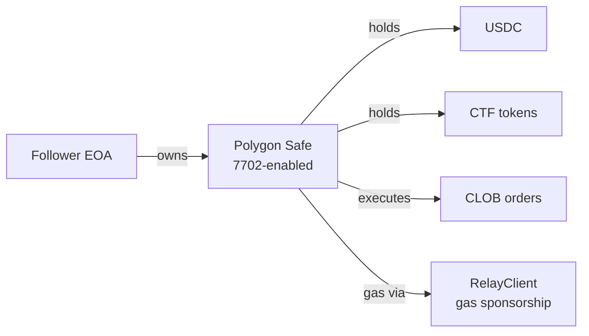

# Copy-Trading System — WebSocket Worker + FIFO PnL

> An end-to-end copy-trading engine: watch any wallet on an upstream prediction-market platform, replicate their trades for a follower, reconcile PnL accurately, and ship it production-hardened.

## Table of Contents

- [System Overview](#system-overview)
- [Ingestion Pipeline](#ingestion-pipeline)
- [Execution Pipeline](#execution-pipeline)
- [Wallet Architecture](#wallet-architecture)
- [FIFO PnL & Win Rate](#fifo-pnl--win-rate)
- [Settings & Filters](#settings--filters)
- [Production Hardening](#production-hardening)
- [Notifications](#notifications)
- [Known Limitations](#known-limitations)

---

## System Overview

```mermaid
graph TB
    subgraph "Ingestion"
        WS[Upstream WS<br/>trade events]
        POLL[Cron Poller<br/>60s fallback]
        FAST[Browser Fast-path<br/>1-3s bonus]
    end

    subgraph "Worker Layer"
        WORKER[Node Worker<br/>Railway<br/>+ heartbeat]
    end

    subgraph "API Layer"
        ENQ[/api/enqueue-cron]
        PROC[Process Queue<br/>cron 30s]
        CRUD[Relationship CRUD]
    end

    subgraph "Database"
        QUEUE[(copy_trade_queue)]
        REL[(copy_trade_relationships)]
        HIST[(copy_trade_history)]
    end

    subgraph "Execution"
        CLOB[CLOB Order<br/>FOK]
        CHAIN[Polygon Chain]
    end

    WS --> WORKER
    WORKER --> ENQ
    POLL --> ENQ
    FAST --> ENQ
    ENQ --> QUEUE
    PROC --> QUEUE
    PROC --> CLOB
    CLOB --> CHAIN
    CHAIN --> HIST
    CRUD --> REL
```

### Core components

- **Upstream WebSocket worker** (Node, Railway) — primary ingestion path
- **Cron poller** (Vercel cron, 60s) — fallback ingestion
- **Browser fast-path** (user-triggered) — bonus low-latency ingestion
- **Queue processor** (Vercel cron, 30s) — drains queue, executes CLOB orders
- **Relationships CRUD** — user-facing API to create/edit/pause copy relationships
- **History + PnL layer** — FIFO queue for PnL, Win Rate, notifications

---

## Ingestion Pipeline

Three sources, all dedup at the DB layer via unique constraint on `(follower_id, tx_hash)`.

### 1. Upstream WebSocket Worker (primary)

Runs as a standalone Node process on Railway with its own Dockerfile.

```typescript
// Worker bootstrap (simplified)
const ws = new WebSocket(UPSTREAM_WS_URL)
const trackedWallets = new Set<string>()

async function refreshTrackedWallets() {
  const res = await fetch(`${APP_URL}/api/tracked-wallets`, {
    headers: { 'x-internal-secret': process.env.CRON_SECRET! }
  })
  const { wallets } = await res.json()
  trackedWallets.clear()
  wallets.forEach((w: string) => trackedWallets.add(w.toLowerCase()))
}

ws.on('open', async () => {
  await refreshTrackedWallets()
  ws.send(JSON.stringify({ type: 'subscribe', channels: ['trades'] }))
})

ws.on('message', async (raw) => {
  const event = JSON.parse(raw.toString())
  if (event.type !== 'order_filled' && event.type !== 'event') return

  const trade = normalizeEvent(event)
  if (!trackedWallets.has(trade.trader.toLowerCase())) return

  // Enqueue for every follower of this trader
  const followers = await fetchFollowers(trade.trader)
  for (const follower of followers) {
    await fetch(`${APP_URL}/api/enqueue-cron`, {
      method: 'POST',
      headers: {
        'x-internal-secret': process.env.CRON_SECRET!,
        'content-type': 'application/json',
      },
      body: JSON.stringify({
        follower_id: follower.id,
        original_trade_id: trade.id,
        tx_hash: trade.txHash,
        asset: trade.tokenId,
        side: trade.side,
        size: trade.size,
        price: trade.price,
      }),
    })
  }
})
```

### Heartbeat + zombie detection

```typescript
let lastPong = Date.now()
ws.on('pong', () => { lastPong = Date.now() })

setInterval(() => {
  if (Date.now() - lastPong > 60_000) {
    console.warn('WS zombie detected, reconnecting')
    ws.terminate()
    reconnect()
  } else {
    ws.ping()
  }
}, 30_000)
```

Without this, we've seen cases where the WS connection silently drops (no error, no close event) and just stops receiving messages. The heartbeat catches this within 60s.

### Reconnect backoff

Exponential backoff from 2s → 60s. On successful reconnect, re-fetch tracked wallets (they may have changed during downtime).

### 2. Cron poller (fallback, 60s)

Calls the upstream Data API every 60s for each tracked wallet's recent activity. Uses Safe/proxy wallet as the query key (not EOA — an early bug, the Data API indexes by Safe address not signer address).

```typescript
async function pollTraders() {
  const wallets = await db.select().from(trackedWallets)
  for (const w of wallets) {
    const activity = await fetchActivity(w.safeAddress)  // Safe, not EOA!
    for (const trade of activity) {
      if (trade.timestamp < w.lastPolledAt) continue
      // Reuse the same enqueue endpoint as worker
      await enqueueTrade(w.followers, trade)
    }
    await db.update(trackedWallets).set({ lastPolledAt: Date.now() })
  }
}
```

### 3. Browser fast-path (bonus, 1-3s)

Follower's own browser may see the trader's trade on a live market feed before the server worker does. Adds a direct ping:

```typescript
// in TraderActivityWidget.tsx
onTradeEvent((trade) => {
  if (trade.trader_wallet === relationship.trader_wallet) {
    fetch('/api/copy-trade/enqueue-fast', {
      method: 'POST',
      body: JSON.stringify({ relationship_id: relationship.id, trade }),
    })
  }
})
```

The fast-path route carries **stamped-request auth** (not internal secret) — so only the actual follower can trigger it.

### Deduplication

Unique constraint:

```sql
CREATE UNIQUE INDEX idx_copy_trade_queue_follower_txhash
  ON copy_trade_queue(follower_id, tx_hash);
```

All three ingestion paths hit `INSERT ... ON CONFLICT DO NOTHING`. Zero application-level coordination — the DB is the arbiter.

---

## Execution Pipeline

### Queue processor (cron, 30s)

```typescript
async function processQueue() {
  const pending = await db.select().from(copy_trade_queue)
    .where(and(
      eq(status, 'pending'),
      lt(attempts, MAX_ATTEMPTS),
    ))
    .orderBy(asc(created_at))
    .limit(10)

  // 10 concurrent executions with bounded concurrency
  await Promise.all(pending.map(executeTrade))
}

async function executeTrade(item: QueueItem) {
  try {
    const result = await submitFOK({
      tokenId: item.asset,
      side: item.side,
      size: item.scaledSize,
      price: item.capPrice,
    })

    if (result.filled) {
      await db.update(copy_trade_queue)
        .set({
          status: 'completed',
          tx_hash: result.txHash,
          actual_sell_value: result.actualSellValue,  // important for PnL
          completed_at: Date.now(),
        })
        .where(eq(id, item.id))

      await sendNotification(item.follower_id, {
        type: 'copy_trade_success',
        trade: result,
      })
    } else {
      await handleFailure(item, result)
    }
  } catch (err) {
    if (isNonRetriable(err)) {
      await markFailed(item, err)
    } else {
      await markPendingRetry(item)
    }
  }
}
```

### Non-retriable errors

Explicit classification — some errors are permanent, retrying them is pointless (and expensive at scale):

| Error pattern | Retriable? | Notes |
|---|---|---|
| `5xx` server error | Yes (backoff, max 3) | Transient |
| `"No shares to sell"` | **No** | Position already closed |
| `"Invalid amount"` | **No** | Parameter error |
| `"Min size"` | **No** | Rounding below minimum |
| `"Market closed"` | **No** | Explicit end-of-life |
| `"FOK fill failed"` | **No** | Market moved too much |
| Network timeout | Yes (backoff) | Transient |

Non-retriable errors mark the queue item `failed` immediately with the reason. The UI shows "failed" with a tooltip of the full error message on hover.

### Scaling

Follower's trade sizes are proportional to the trader's:

```typescript
const copyFraction = relationship.max_per_trade / trader.typical_size
const scaledSize = trade.size * copyFraction

// Enforce max exposure
const currentExposure = await getExposure(follower.id, trade.tokenId)
const remainingRoom = relationship.max_exposure - currentExposure
const finalSize = Math.min(scaledSize, remainingRoom)
```

### Dedup within execution

Ten queue items processed concurrently means we might try to execute duplicates if the unique constraint failed at insert time (shouldn't, but defense in depth). Execution re-checks:

```typescript
// Before executing, fetch position
const existingPosition = await fetchFollowerPosition(item.follower_id, item.asset)
if (existingPosition.recentTradeHash === item.originalTradeId) {
  // Already copied, mark as duplicate
  await markDuplicate(item)
  return
}
```

---

## Wallet Architecture

Each follower gets a **dedicated Safe wallet** on Polygon for copy-trading.



### Why a dedicated Safe?

- **Isolation** — copy trades don't touch the user's primary wallet
- **Policy** — can limit per-trade / per-day spending via Safe modules
- **Gas sponsorship** — 7702 on Polygon allows relay-sponsored tx
- **Auditability** — all copy trades visible on a single address

### Auto-deployment on withdraw

First-time withdraw requires the Safe to be deployed. If not:

1. Deploy Safe via factory (gas-sponsored)
2. Poll for deployment up to **2 minutes**
3. If timeout: return HTTP 202 with "deployment pending" state
4. Frontend polls `/api/copy-trade/safe-status` every 10s

This prevents the withdraw API from hanging for 2+ minutes on a slow deploy.

### Fund & withdraw flow

- **Fund:** user sends USDC to Safe via internal transfer (gas-sponsored) or external bridge
- **Withdraw:** RelayClient-powered gas-sponsored Safe tx moves USDC back to user's primary wallet
- **Fund Wallet Security Dialog** shown on first fund — explains the security model before user deposits

### Real-time wallet display

- Wallet balance shown on copy-trading dashboard with auto-refresh on notification arrival
- Copy address (shows "Copied!" feedback) with correct chain name toast
- MAX button (pre-fill full balance)
- Empty wallet banner prompting deposit if balance < minimum

---

## FIFO PnL & Win Rate

Accurate attribution across partial fills, redeems, and cross-source trades.

### The problem

Every copy trade queue item becomes either:
- **Completed** — `actual_sell_value` captured, PnL computable
- **Failed** — no PnL, counted against queue stats
- **Skipped** — filters didn't match, counted against queue stats

Original PnL calculation used `calculated_size × avg_price` which:
- Ignored `actual_sell_value` (off by slippage)
- Counted REDEEM as not-a-trade (broke Win Rate)
- Treated SELL exceeding the BUY queue head as negative-infinity (crash)

### The fix

Shared FIFO algorithm, applied per-tokenId per-follower:

```typescript
function calculateFollowerPnL(followerId: string) {
  const trades = db.select().from(copy_trade_queue)
    .where(and(eq(follower_id, followerId), eq(status, 'completed')))
    .orderBy(asc(completed_at))

  const byToken = groupBy(trades, t => t.asset)
  let totalRealized = 0
  let totalRoundTrips = 0
  let totalWins = 0

  for (const [tokenId, tokenTrades] of byToken) {
    const fifo = []  // [{ shares, cost }]

    for (const trade of tokenTrades) {
      if (trade.side === 'BUY') {
        fifo.push({ shares: trade.shares, cost: trade.calculated_size })
      } else {
        // SELL or REDEEM
        let remaining = trade.shares
        let matchedCost = 0
        while (remaining > 0 && fifo.length > 0) {
          const head = fifo[0]
          if (head.shares <= remaining) {
            matchedCost += head.cost
            remaining -= head.shares
            fifo.shift()
          } else {
            const ratio = remaining / head.shares
            matchedCost += head.cost * ratio
            head.cost *= (1 - ratio)
            head.shares -= remaining
            remaining = 0
          }
        }
        const proceeds = trade.actual_sell_value  // canonical
        const pnl = proceeds - matchedCost
        totalRealized += pnl
        totalRoundTrips += 1
        if (pnl > 0) totalWins += 1
      }
    }
  }

  return {
    realizedPnL: totalRealized,
    winRate: totalRoundTrips === 0 ? 0 : totalWins / totalRoundTrips,
    totalRoundTrips,
    totalWins,
  }
}
```

### Redeem as SELL

When a position resolves in-our-favor, we record the redeem payout as a SELL with:

```typescript
{
  side: 'SELL',
  shares: totalRedeemedShares,
  calculated_size: original_buy_cost,  // so cost basis matches
  actual_sell_value: on_chain_payout,
  tx_hash: redeemTxHash,
  status: 'completed',
}
```

This way, a winning redeem counts as a winning round-trip (Win Rate increases), and realized PnL includes the full payout.

### Unrealized PnL

For positions still open:

```typescript
unrealized = fifo.reduce((sum, lot) => {
  const currentValue = lot.shares * currentMidpoint
  return sum + (currentValue - lot.cost)
}, 0)
```

Midpoint fetched from CLOB midpoint, or outcome price for resolved markets (early bug: was using CLOB midpoint for resolved markets, causing "still winning" display on already-lost positions).

### Dashboard Win Rate

Shown on trader card: **Win Rate** displayed is the **trader's historical stat** (from their own account), NOT the copy-follower's rolling Win Rate. Clarified in copy labels because users were confused about which was which.

Follower's own rolling Win Rate is shown on the follower dashboard separately.

---

## Settings & Filters

### Relationship settings

Per copy-trading relationship, user configures:

- **Max per trade** (USD) — cap on single trade size
- **Max exposure** (USD) — cap on total concurrent open value
- **New positions only** — filter out SELLs (closing positions) — actually: SELL is always allowed (can't leave followers unable to close), `new_positions_only` filters BUYs against existing holdings
- **Copyable toggle** — pauses all copies from this trader (toggle off = pause, on = resume)
- **Visible to trader** — deprecated, removed from UI

### Filter evaluation

End-to-end tested:

```typescript
function shouldCopy(trade: Trade, relationship: Relationship, follower: Follower): SkipReason | null {
  if (!relationship.copyable) return 'paused'
  if (trade.size * trade.price > relationship.max_per_trade) return 'max_per_trade'

  const currentExposure = await getExposure(follower.id, trade.tokenId)
  if (currentExposure + trade.size * trade.price > relationship.max_exposure) {
    return 'max_exposure'
  }

  if (relationship.new_positions_only && trade.side === 'BUY') {
    const existing = await getPosition(follower.id, trade.tokenId)
    if (existing.shares > 0) return 'new_positions_only'
  }

  if (follower.wallet_balance < trade.size * trade.price) {
    return 'insufficient_balance'
  }

  return null  // should copy
}
```

Skip reasons are counted and shown on the trader card (`skipped: N` bucket).

### Settings UI fixes

- Position settings persisted in localStorage (`hidden positions` was resetting on nav)
- Settings modal edit-mode via PATCH, not POST (was creating duplicate relationships)
- Removed dead settings: Min Win Rate, New Positions Only (latter replaced with simpler BUY filter)

### Trader card display

All current settings shown on the trader card in one line (was grid, cluttered):

```
Max $100/trade · Max $1000 exposure · New positions only · Copyable
```

Sort order: by last-trade activity (most recent first) rather than creation date.

---

## Production Hardening

### 5 security & correctness fixes

Detailed in [SECURITY_HIGHLIGHTS.md](./SECURITY_HIGHLIGHTS.md). Summary:

1. Private-key scope leak → scoped
2. Unauthenticated enqueue endpoint → cron-only
3. Stamped-request auth before body parse
4. Case-sensitivity in EOA lookup
5. FOK fill without orderID non-retriable

### Queue worker hardening

- Fail-closed RPC fallback (primary → secondary → error)
- Bounded concurrency (10 simultaneous CLOB submits max)
- PostgreSQL connection pooling (5-20 conns)
- Graceful degradation on Redis/cache failure
- Circuit breaker pattern on repeated upstream 5xx

### Deployment

- Railway Dockerfile for worker (`.dockerignore` tight)
- Vercel cron configuration in `vercel.json`
- Environment-aware config (dev auth bypass via `ENABLE_DEV_AUTH_BYPASS`)
- Production deployment guide in `docs/`

---

## Notifications

### Events that notify

- Copy trade filled → `✅ Bought 100 YES on "Trump 2028" @ $0.42`
- Copy trade failed → `❌ Failed to copy: insufficient balance`
- Copy trade skipped → `⏭ Skipped: max exposure reached`
- Resolved position → `🎉 Your "Trump 2028" position is redeemable for $47.50`
- Manual sell → `"Manual sell executed"` (NOT "Copy trade" — label confusion)

### Polling cadence

5-second polling for instant position refresh after notification. This replaced a 60s polling cycle because users kept missing their fills.

### Deduplication

- By `tokenId` for redeem notifications (multiple listeners could fire on one redeem)
- By `tx_hash` for fill notifications
- Metadata stored in `notifications.metadata` jsonb column for dedup key lookup

### Auto-refresh on notification

On incoming notification:
- Positions invalidated
- Stats invalidated
- Wallet balance invalidated

Single notification → full dashboard refresh, without user action.

---

## Known Limitations

Honest list:

- **Trader's own trades on different platforms not copied.** We watch one platform per relationship. Cross-platform arbitrage isn't detected.
- **Follower can't trade manually on the same Safe without race conditions.** Recommended UX: keep manual trading on primary wallet, automated copies on dedicated Safe.
- **WS worker single point of failure.** If Railway goes down, falls back to 60s polling (degraded). Running two workers needs cross-worker dedup — backlog item.
- **No backfill on relationship creation.** When a user adds a new trader, we don't replay trades from before the relationship was created. Discussed with product, decision was "by design" — follower opts in from this moment forward.
- **`x-on-behalf-of` migration backlog.** Portfolio fetches still use 409-fallback pattern. Cleaner: unified HMAC `on-behalf-of` everywhere (tracked).

---

*Next: [SECURITY_HIGHLIGHTS.md](./SECURITY_HIGHLIGHTS.md) for the 5 security & correctness fix writeups.*
