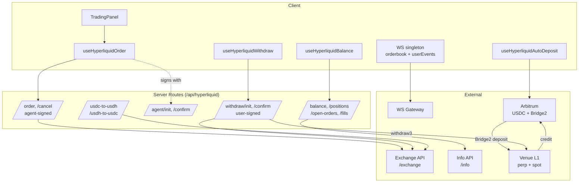

# Protocol C Integration — Outcome Markets on a High-Performance L1

> Full integration of an outcome-market venue built on its own high-performance L1 (not EVM). Scope included an agent-wallet signing model, a WebSocket-driven orderbook under a strict rate-limit budget, a three-stage withdraw, a watched cross-chain deposit/auto-fund pipeline, and platform-native decimal pricing. This was the last of the protocol integrations shipped, and by far the most protocol-specific — almost nothing carried over from the EVM venues.

## Table of Contents

- [Platform Overview](#platform-overview)
- [Why This One Was Different](#why-this-one-was-different)
- [Integration Scope](#integration-scope)
- [Architecture](#architecture)
- [Agent-Wallet Signing Model](#agent-wallet-signing-model)
- [Order Signing & Nonce Handling](#order-signing--nonce-handling)
- [Order Flow & Status FSM](#order-flow--status-fsm)
- [WebSocket & the Weight Budget](#websocket--the-weight-budget)
- [Deposit & Auto-Fund Pipeline](#deposit--auto-fund-pipeline)
- [Three-Stage Withdraw](#three-stage-withdraw)
- [Collateral Migration (USDH → USDC)](#collateral-migration)
- [Platform-Native Decimal Pricing](#platform-native-decimal-pricing)
- [Real Outcome Side Names & Per-Side Chart](#real-outcome-side-names)
- [Fallback Outcomes](#fallback-outcomes)
- [Production Hardening](#production-hardening)
- [Known Limitations](#known-limitations)

---

## Platform Overview

Protocol C is a prediction-market venue that runs on its own purpose-built **L1 (not EVM)**, with a REST/WebSocket trading API rather than on-chain calldata. Core mechanics relevant to the integration:

- **Outcome markets as spot pairs.** Each outcome is represented by two spot tokens — a "YES share" and a "NO share" — that trade against the venue's stablecoin collateral. The two prices are no-arbitrage constrained to sum to ≈ $1.00. At resolution the winning side pays $1 per share.
- **Collateral:** USDC (migrated from the venue's native stable, **USDH** — see [Collateral Migration](#collateral-migration)). Collateral originates on **Arbitrum** and is bridged onto the venue's L1 via the venue's deposit bridge.
- **Market types:**
  - `priceBinary` — single threshold ("BTC ≥ $80,323 by May 16")
  - `priceBucket` — multi-outcome continuous ranges (Below / Between / Above at threshold points)
  - named-outcome questions — sports ("San Antonio" vs "New York"), policy ("Change" vs "No Change")
- **Order types:** `Gtc` (good-till-cancel, limit), `Ioc` (immediate-or-cancel, market-style), `Alo` (add-liquidity-only, post-only).
- **Builder codes:** optional per-order attribution field passed straight through to the exchange endpoint.
- **Rate limiting:** a hard **1200 weight/min per IP** budget that shaped the entire read architecture (see [WebSocket & the Weight Budget](#websocket--the-weight-budget)).

From an integration standpoint this is the opposite of the EVM integrations: there is **no calldata, no allowance, no gas**. Trades are REST actions signed off-chain and POSTed to the exchange. That moved almost all the complexity into **how orders are signed, who signs them, and how reads are budgeted**.

---

## Why This One Was Different

The three prior integrations (Protocol A/B and the copy-trading upstream) were all EVM: the trade hook ended in `sendTransaction(calldata)`, the position source was `CTF.balanceOf`, and auth was either an API key or HMAC.

Protocol C broke every one of those assumptions:

| Concern | EVM integrations | Protocol C |
|---|---|---|
| Trade execution | on-chain calldata + gas | off-chain signed REST action |
| Signing | user wallet per tx | **agent wallet, signed silently server-side** |
| Positions | `CTF.balanceOf` | exchange REST (`clearinghouseState`) |
| Live data | poll / WS price | WS orderbook **inside a weight budget** |
| Collateral | ERC-20 on the trade chain | bridged from Arbitrum, perp/spot split |
| Price unit | cents (¢33.10) | decimal probability (0.3310) |
| Withdraw | bridge out | three-stage (convert → transfer → user-signed `withdraw3`) |

So this doc spends most of its length on the four things that have no analogue in the other integrations: the **agent-wallet model**, the **weight budget**, the **deposit/auto-fund pipeline**, and the **three-stage withdraw**.

---

## Integration Scope

### Foundation (shared primitives extended)
- `Platform` union extended with `'hyperliquid'`; icon, logo, name map
- Explore filter wiring (surfaced under a "More" dropdown rather than a top-level pill)
- i18n keys for the `hyperliquid.*` namespace in `en` / `ko` / `zh`, including hook-level toasts
- Single env switch `HYPERLIQUID_TESTNET=1` flips the **entire stack** — endpoints, chain, bridge address, spot-pair indices, collateral token — with no per-value overrides

### API layer (new)
- Typed client (`/src/lib/api/hyperliquid.ts`): `postInfo<T>()`, `getOutcomeMeta()`, `getL2Book()`, `getAllMids()` — all with a 15s `AbortSignal.timeout` (a hung upstream had previously blocked a Next.js worker indefinitely)
- Normalizers (`/src/lib/api/normalizers/hyperliquid.ts`, ~250 LOC):
  - `normalizeHyperliquidEventsToList()` / `normalizeHyperliquidEventToDetail()` — outcome metadata → internal event/market types, grouping multi-outcome questions and standalones
  - `outcomeSideLabels()` — extracts custom side names from the metadata's `sideSpecs`, returns `undefined` for literal Yes/No to preserve the signal of a genuinely custom-labeled market
  - `buildOutcomeDisplayMap()` — caches title + image so a settled position still renders even after it drops out of the active metadata
  - a separate parser for the venue's pipe-delimited outcome descriptions (`class:priceBinary|underlying:BTC|expiry:20260516-0600|targetPrice:80323`)
- **18 server proxy routes** under `/src/app/api/hyperliquid/` — balance, positions, open-orders, fills, orderbook, candles, order, cancel, agent init/confirm, transfer init/confirm, withdraw init/confirm, and the two USDH↔USDC conversion routes. Every route authenticates the caller via a stamped-request (`whoami`) check before doing anything privileged.

### Trading (new)
- Per-user **agent wallet** bootstrap (`/agent/init`, `/agent/confirm`)
- `useHyperliquidOrder` / `useHyperliquidCancel` hooks
- Server-side order placement with full runtime input validation, L1-action signing, and nonce generation
- Order-status FSM mapped to user toasts (filled / partial / resting / rejected)

### Reads (new)
- WS singleton (`/src/lib/realtime/hyperliquid-ws.ts`) — orderbook + user events, refcounted subscriptions, heartbeat-based zombie detection
- Balance / positions / open-orders / fills hooks with relaxed polling intervals tuned to the weight budget
- Settlement watcher that detects post-resolution auto-credits

### Funds (new)
- Watched Arbitrum→L1 deposit (`useHyperliquidAutoDeposit`) with auto-fund (perp → spot) when the user is on the venue page
- Three-stage withdraw (`useHyperliquidWithdraw`)
- Cross-tab locks for deposit, bridge, and withdraw (localStorage + TTL)
- Stranded-balance recovery banner

### Portfolio (new)
- Positions / open-orders / fills tabs, one-click sell, cancel
- Settled-position rendering via the display-map cache

---

## Architecture



---

## Agent-Wallet Signing Model

The defining design decision. On an EVM venue every trade is a wallet popup. On Protocol C, prompting the user to sign every order would be unusable — so the venue's **agent-wallet** primitive is used:

1. **One-time approval.** The user signs an `ApproveAgent` action **once** with their primary wallet (EIP-712). This authorizes a dedicated agent key to act for their account.
2. **Silent server-side signing.** Every subsequent order/cancel is signed **on the server** by that agent key — no wallet popup per trade.
3. **Withdrawals stay user-signed.** `withdraw3` is deliberately signed by the **user's primary wallet**, not the agent. An agent can place and cancel orders; it **cannot pull funds out**. This is the security boundary of the whole model.

### Agent key storage

The agent private key is generated server-side and encrypted at rest with **AES-256-GCM**, using the **userId as Additional Authenticated Data (AAD)**:

```text
ciphertext = AES-256-GCM(plaintext = agentPrivKey,
                         key       = server master key,
                         aad       = userId)
```

Binding the ciphertext to the userId via AAD means a row copied into another user's record **fails to decrypt** — integrity is enforced cryptographically, not by application logic. On load, the key is scoped to the requesting userId, so an agent can only ever sign for its own owner's account.

This mirrors the defense-in-depth principle from the copy-trading key-scope fix (see [SECURITY_HIGHLIGHTS.md](./SECURITY_HIGHLIGHTS.md#1-private-key-scope-leak)): signing keys live only as long, and in as narrow a scope, as the operation that needs them.

---

## Order Signing & Nonce Handling

Orders are **L1 actions**, not transactions. The server builds the action, signs it, and POSTs it:

```ts
// Simplified
const action = {
  type: 'order',
  orders: [{
    a: encodeOutcomeAssetId(outcome, side), // spot asset id for this YES/NO leg
    b: isBuy,
    p: priceTick,   // string, e.g. "0.3250" — decimal probability
    s: size,        // string, e.g. "10"
    r: reduceOnly,  // always false on spot — see Known Limitations
    t: { limit: { tif } }, // Gtc | Ioc | Alo
  }],
  grouping: 'na',
  ...(builderCode ? { builder: builderCode } : {}),
}
```

Signing follows the venue's scheme:

1. msgpack-encode the action
2. `actionHash = keccak256(msgpack || nonce || vault || expiresAfter)`
3. EIP-712 sign the hash with the agent key over a **phantom domain** (`chainId = 1337`, even on mainnet — the L1 is not EVM, so the chainId is a fixed protocol constant, not a real network)
4. POST `{ action, nonce, signature }` to `/exchange`

### The nonce overflow bug

Nonces must be unique and within the venue's accepted range. The first implementation was:

```ts
const nonce = Date.now() * 1000 // WRONG
```

The intent was millisecond × 1000 to leave room for a sub-ms counter. But `Date.now() * 1000` ≈ **1.78 quadrillion**, which **overflowed the venue's max nonce** (≈ 1.78 trillion — roughly `Date.now()` itself plus a small window). Every order was rejected with "nonce too high".

Fix:

```ts
const nonce = BigInt(Date.now()) + BigInt(Math.floor(Math.random() * 1000))
```

This stays within ~1 second of real time (well inside the accepted range) while a 0–999 random suffix prevents same-millisecond collisions between two rapid orders. Nonces are generated **per request on the server**, so there's no client-side nonce state to race.

> Earlier, a related collision bug existed when the nonce was plain `Date.now()` — two orders fired in the same millisecond produced identical nonces and the second was rejected. The random suffix fixed both the collision and (after the overflow correction) the range problem.

---

## Order Flow & Status FSM

`useHyperliquidOrder` runs:

1. **Pre-submit balance refetch.** `refetchQueries(['hl-balance'])` before building the order — closes a stale-cache race where a just-settled deposit/withdraw hadn't propagated.
2. **Client-side affordability check.** For buys, assert `size * priceTick ≤ availableCollateral + ε` and throw a readable error rather than letting the exchange reject it opaquely.
3. **Stamped POST** to `/api/hyperliquid/order`; the server validates, signs with the agent key, submits, and returns the per-order status.
4. **Targeted invalidation** of `['hl-balance']`, `['hl-positions']`, `['hl-open-orders']` on success.

Server-side input validation is strict (this is a money path):

| Field | Rule |
|---|---|
| `outcome` | integer, 0 … 1,000,000 |
| `side` | 0 (YES asset) or 1 (NO asset) |
| `priceTick` | parses as float, `0 < p < 1` (decimal format) |
| `size` | positive |
| `tif` | one of `Gtc` / `Ioc` / `Alo` |

The exchange returns a per-order status, mapped to user feedback:

| Status | Toast |
|---|---|
| `filled` (full) | "Bought N YES @ X¢" (success) |
| `filled` (partial) | "Bought N of M — partial fill" (warning) |
| `resting` | "Limit buy placed — N YES @ X¢" (success) |
| `error` | "Order rejected: &lt;reason&gt;" (error) |

Before this, resting and error statuses were silently dropped — a limit order that rested looked like nothing happened, and a rejection looked like a hang.

---

## WebSocket & the Weight Budget

The venue enforces **1200 weight/min per IP**. Because all users on a server instance share that IP, the budget is **per-server, not per-user** — and the naive polling design didn't survive contact with a second concurrent user.

### The problem

The original read layer polled everything:

| Resource | Interval | Weight | Per-user/min |
|---|---|---|---|
| orderbook | 2s | 2 | ~60 |
| open-orders | 5s | 20 | ~240 |
| positions | 5s | 4 | ~48 |
| balance | 10s | 4 | ~24 |
| fills | 15s | 20 | ~80 |
| **total** | | | **~450** |

At ~450 weight/min per user, **two concurrent users saturated the 1200 budget** and a third triggered cascading 429s for everyone on that instance.

### The fix (two parts)

**1. Move the orderbook to WebSocket.** The orderbook was both the most latency-sensitive resource and (at a 2s poll) a constant drain. A singleton WS connection now drives it, eliminating the poller entirely.

**2. Relax the remaining polls** to the slowest interval each surface tolerates:

| Resource | Before | After | Weight/min after |
|---|---|---|---|
| orderbook | 2s poll | **WS** (10s poll = fallback only) | ~12 |
| open-orders | 5s | 15s | ~80 |
| positions | 5s | 15s | ~16 |
| balance | 10s | 20s | ~12 |
| fills | 15s | 15s | ~80 |
| **total** | **~450** | | **~108** |

~450 → ~108 weight/min per user — roughly **11 concurrent users per server IP** instead of 2–3.

### WS singleton design

- **One connection per app instance**, multiplexing all subscriptions
- **Refcounted subscriptions:** `subscribe(key, cb)` returns an unsubscribe fn; when the refcount for a key hits 0 the server is told to unsubscribe
- **Heartbeat / zombie detection:** a 10s tick sends `ping` after 25s idle and force-closes the socket after 50s idle, dropping into the reconnect path. Without this, a silently-dead TCP connection (network partition, gateway hang) would leave the orderbook frozen for 30s–5min until the OS keepalive timed out.
- **Exponential reconnect backoff with jitter:** 2s → 4s → 8s → … → 60s (jittered so a venue-side blip doesn't produce a synchronized reconnect stampede)
- The venue renamed the spot asset context channel mid-integration; the router maps both the old and new channel names to the same handler so the rename was a no-op for callers.

---

## Deposit & Auto-Fund Pipeline

Getting funds onto the venue is a two-hop problem: **Arbitrum USDC → L1 perp balance** (the bridge), then **perp → spot** (auto-fund), because outcome shares trade on spot.

### Watched deposit

`useHyperliquidAutoDeposit` (mounted globally) polls the user's Arbitrum USDC balance every 12s and establishes a **baseline floor on first read** — pre-existing USDC is deliberately **not** swept. When the balance grows ≥ $5 above the floor, it fires a sponsored `Bridge2.deposit` (a plain ERC-20 transfer to the bridge address — validators pick it up off-chain, no contract method) and waits for the L1 credit.

Hardening that this path needed:

- **5s settle wait before the deposit** — the paymaster node and the balance-read node lag each other; firing immediately produced spurious "exceeds balance" rejections.
- **5-retry loop with exponential backoff** (3s/5s/8s/12s), but **only** on paymaster 400s ("exceeds balance", "paymaster reverted"). Real config errors short-circuit instead of retrying.
- **Silent-success detection** — if the response times out but the Arbitrum balance dropped, the deposit landed; don't re-fire.
- **Floor to 2 decimals**, not whole dollars — the first version floored to integers and silently lost up to $0.99 per deposit.

### Cross-tab deposit lock

Three independent code paths can fire a deposit — the global auto-watcher, the manual modal, and the stranded-deposit banner. With two tabs open they could double-fire and drain the same EOA. A per-tab **localStorage lock** (`hl-deposit-lock`, 60s TTL, tab-id + timestamp, read-after-write verification) serializes them. localStorage has no compare-and-swap, so the read-after-write check is how a winner is chosen.

### Auto-fund race

The auto-fund step (perp → spot) ran in an async IIFE that could fire **between** a withdraw's guard check and its spot-balance read, grabbing USDC the withdraw was about to use. Fixed by re-checking the withdraw-pending flag immediately before firing, and nulling the snapshot ref on error so the next tick retries cleanly.

---

## Three-Stage Withdraw

Withdrawing is the inverse two-hop plus a conversion, gated by the venue's **$10 spot-order minimum**. `useHyperliquidWithdraw` runs up to three stages:

1. **Convert (conditional).** If spot holds stranded USDH ≥ $10, convert it USDH → USDC via an agent-signed spot order on the conversion pair. Sub-$10 USDH **can't be converted** (the order minimum) and is excluded from the withdrawable max.
2. **Perp → spot (conditional).** If spot USDC is short of the requested amount, move perp USDC to spot via a free internal `usdClassTransfer` (no order, no fee).
3. **`withdraw3` (user-signed).** Server returns typed data → user signs with their **primary wallet** → server POSTs the signed `withdraw3` to `/exchange`. Validators credit Arbitrum USDC in ~3–4 min, minus the venue's $1 bridge fee.

### Double-withdraw on connection drop

The dangerous window: the `/confirm` request reaches the venue, the withdraw executes, but the **response is lost** (network drop, tab closed). A retry with a fresh nonce would issue a **second** withdrawal.

Fix — a **pessimistic flag set before the POST, not after the response**:

```ts
// Set IMMEDIATELY before POST, not in the success handler
localStorage.setItem(
  `hl-withdraw-pending-${addr.toLowerCase()}`,
  String(Date.now() + 5 * 60 * 1000),
)
```

- On an **explicit** 4xx/5xx (with body): the venue rejected it and never withdrew → **clear** the flag, retry is safe.
- On a **network** error (no response): the venue's state is unknown → **keep** the flag, err on "wait".
- The flag auto-expires after 5 min so a genuinely-stuck user isn't locked out forever. The UI disables the button and shows a countdown while it's set.

This is the pessimistic-lock mirror of the deposit lock: when you can't know whether a remote mutation happened, default to "assume it did".

### Practical-max calculation

The withdraw UI shows a **practical** max, not the raw balance sum, because stranded sub-$10 USDH can't actually leave:

```text
directlyAvailable = perp USDC + spot USDC
usdhConvertible   = (spot USDH ≥ $10) ? spot USDH * 0.995 : 0   // 0.995 ≈ spot spread
practicalMax      = directlyAvailable + usdhConvertible          // fee deducted by venue at settlement
```

Two bugs lived here:
- The first version **over-stated** the max by including unconvertible sub-$10 USDH — users tried to withdraw an amount that couldn't be assembled.
- A later version **under-stated** it by subtracting the $1 fee client-side, leaving $1 permanently stranded — the venue deducts the fee at settlement, not upfront, so subtracting it locally was double-counting.

A yellow hint explains held-but-unwithdrawable USDH: *"$X held in shares is under the venue's $10 spot-conversion minimum and can't be withdrawn yet — wait for resolution or trade up to $10+ on spot."*

### Bridge over-sweep

The stranded-balance recovery banner (which re-bridges if the active-bridge state goes stale > 30 min) originally bridged the **full live Arbitrum EOA balance** instead of the expected withdraw amount. A user with $50 pre-existing USDC withdrawing $100 would bridge $150 — sweeping the $50 they hadn't asked to move. Fixed by capping the bridge amount at `min(liveBalance, expectedAmount)` and persisting `expectedAmount` to localStorage so the recovery path knows the right figure.

---

## <a id="collateral-migration"></a>Collateral Migration (USDH → USDC)

Mid-integration the venue moved outcome-market collateral from its native **USDH** to **USDC**. This touched the whole stack:

- All trading-panel and order-hook affordability guards switched from `usdhAvailable` to `usdcAvailable`
- Auto-fund stopped converting USDC → USDH and now keeps USDC on spot
- A non-fatal USDH → USDC migration step was added for legacy users holding stranded USDH (agent-signed, wrapped in try/catch — best-effort, never blocks the main flow)
- The withdraw flow's stage 1 (above) exists specifically to drain legacy USDH

The migration was done so that a user mid-flight (USDH on spot, USDC arriving) never hit a dead end — both collaterals are tolerated, with USDC as the path forward.

---

## Platform-Native Decimal Pricing

The other three venues quote in **cents** (¢33.10). Protocol C quotes in **4-decimal probability** (0.3310), tick = 0.0001. Showing cents would mismatch the venue's own UI and confuse anyone cross-checking.

The app renders **platform-native** format everywhere — orderbook, chart, positions, limit input — with two deliberate exceptions that stay uniform across all platforms:
- the "% Chance" headline ("33.2% Chance") — a platform-agnostic summary
- the trade-success toast ("Bought 50 YES @ 33.2¢") — human-readable, consistent across venues

The shared `LimitPriceInput` takes a `priceMode: 'cents' | 'decimal'` prop and the backing state matches the mode (decimal stores `"0.3250"`, cents stores `"32.5"`). A subtle bug fixed here: a conversion round-trip on every keystroke meant typing `"47"` got clamped at `"4"` — dropping the round-trip and storing the native string fixed it.

---

## <a id="real-outcome-side-names"></a>Real Outcome Side Names & Per-Side Chart

The venue ships custom side names in the outcome metadata's `sideSpecs` — e.g. ["Change", "No Change"] for a Fed-rate market, ["San Antonio", "New York"] for a game. Hardcoding "Yes/No" was actively misleading: on a named-outcome market the user couldn't tell which side was which in the orderbook, chart, or trade panel.

A shared `outcomeSideLabels()` helper extracts the custom names and returns `undefined` for literal Yes/No (preserving the signal of a *genuinely* custom-labeled market), wired into both list and detail normalization. The chart was also hardcoded to the YES coin; `selectedSide` now threads through trade-view → PriceChart → the venue chart so it plots the correct side's candles when the user toggles the orderbook to NO.

---

## Fallback Outcomes

Every multi-outcome question ships a protocol-level "fallback" outcome ("None of the above") as a safety net. In practice the named set is exhaustive — price buckets partition the whole line, team lists are complete — so the fallback can essentially never resolve YES, and the venue returns a flat 0.5/0.5 mid with no orderbook for it.

The UI was surfacing a misleading "Fallback · 50% · $0" row. The venue's own UI hides it, so the integration does the same: `tradableChildIds()` returns only the named outcomes, while the fallback stays in the display-map cache so a settled position can still resolve a title.

---

## Production Hardening

A running list of correctness fixes shipped during and after the initial build (the security-relevant ones are written up in [SECURITY_HIGHLIGHTS.md](./SECURITY_HIGHLIGHTS.md)):

### Funds & withdraw
- Bridge over-sweep capped at `min(live, expected)` (see above)
- Double-withdraw pessimistic flag (see above)
- Withdraw practical-max corrected (no client-side fee subtraction)
- IOC close changed from `topOfBook − 1 tick` to `topOfBook * 0.9` and now verifies fill — on thin books the 1-tick version got zero fills and reported the position closed while it remained open
- Withdraw retry button un-stuck (status was left at `error` so the button stayed permanently disabled)

### Reads & rate limits
- Orderbook → WS, polls relaxed under the weight budget
- WS heartbeat + zombie detection; exponential reconnect backoff with jitter
- `AbortSignal.timeout(15s)` on all `/info` and `/exchange` calls — a hung upstream had blocked a worker indefinitely

### Trading & UX
- Resting + error order statuses surfaced (were silently dropped)
- Limit price in native decimal format; keystroke clamp bug fixed
- Limit-price field ordered before Yes/No to match the other venues' panels
- bid/ask/mid quick-select on limit price
- One-click sell from a positions row; sell deep-link now switches the active panel tab
- Bucket children render their real title, not "Bucket N"
- Real side names + per-side chart (see above)

### Onboarding & concurrency
- Cross-tab deposit / bridge / withdraw locks
- Pre-flight balance refetch before order submit
- Trade-minimum surfaced up front; new-user onboarding fixes
- Pre-prod input validation + Sentry capture + an SSR lock guard

---

## Known Limitations

Honest list, in the spirit of the rest of this portfolio:

- **No reduce-only on spot.** The venue rejects any order with `reduceOnly: true` on spot ("reduce-only is invalid for spot trading"). Outcome shares are spot tokens, so quick-sell uses a plain IOC, not a reduce-only. A consequence: a **sub-$10 position can't be sold** (below the spot order minimum) — the UI shows a "Min $10" pill instead of a sell button, and the user is stuck until resolution auto-credits or the position appreciates past $10.
- **Sub-$10 USDH is unwithdrawable** until it can be batched to ≥ $10 on spot (same order-minimum constraint). Surfaced in the UI rather than hidden, but it's a real dead-end for dust.
- **Weight budget is per-server-IP.** ~11 concurrent users per instance. Beyond that, horizontal scaling (more IPs) or a shared subscription proxy would be needed — tracked, not yet required at current load.
- **Agent-wallet model trusts the server with the agent key.** The boundary is correct (agents can't withdraw), but a server compromise could place/cancel orders for users. Withdrawals remaining user-signed is the mitigation; a fuller fix would push agent-key custody to a KMS/HSM.
- **`chainId = 1337` phantom domain** is a venue protocol constant, not a network — worth flagging to anyone auditing the signing path who expects a real chainId.

---

*See [README.md](./README.md) for the portfolio overview, [ARCHITECTURE.md](./ARCHITECTURE.md) for where this sits in the system, and [SECURITY_HIGHLIGHTS.md](./SECURITY_HIGHLIGHTS.md) for the security write-ups referenced above.*
