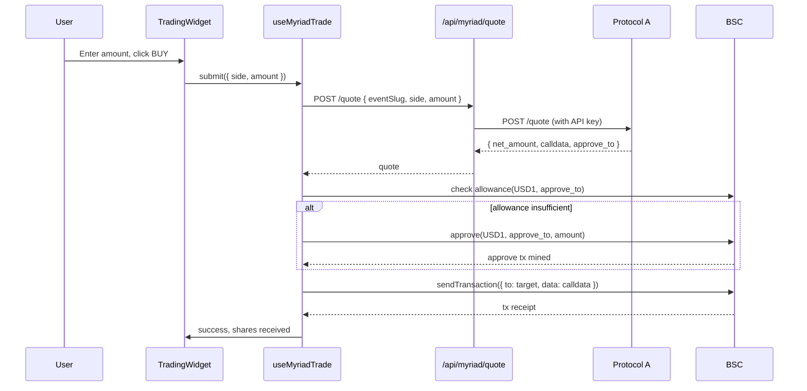

# Protocol A Integration — Binary-Options AMM on BSC

> Full integration of an on-chain binary-options platform into the product. Scope included the trading hook, portfolio view, candle-markets page, cross-chain deposit/withdraw, and stablecoin auto-swap.

## Table of Contents

- [Platform Overview](#platform-overview)
- [Integration Scope](#integration-scope)
- [Architecture](#architecture)
- [Trading Flow](#trading-flow)
- [Candle Markets](#candle-markets)
- [Cross-Chain Deposit & Withdraw](#cross-chain-deposit--withdraw)
- [USDT ↔ USD1 Auto-Swap](#usdt--usd1-auto-swap)
- [Normalizer Design](#normalizer-design)
- [Testing](#testing)
- [Production Hardening](#production-hardening)

---

## Platform Overview

Protocol A is a binary-options style prediction-market platform running on BNB Chain (BSC). Core mechanics:

- **Collateral:** USD1 stablecoin (non-canonical, bridged from USDT via swap)
- **Market types:** single binary outcomes (YES/NO) and multi-outcome events
- **Settlement:** trusted oracle per market, with observation windows for candle markets
- **Liquidity:** AMM pool per market (not order-book)

From an integration standpoint: quote-driven trades (server returns calldata, client executes), BEP-20 approvals, portfolio fetched via REST API.

## Integration Scope

### Foundation (pre-existing primitives extended)

- `Platform` type union extended with `'myriad'`
- Platform icon, logo file, logo name map (`logos.ts`, `platformNames.ts`)
- `platformFilterBar` — added Protocol A button
- i18n: translation keys added for `myriad.*` namespace in `en`, `ko`, `zh`

### API Layer (new)

- Typed client (`/src/lib/api/myriad/client.ts`)
  - `fetchEvents()`, `fetchEventDetail(slug)`, `fetchMarket(slug)`
  - `fetchQuote({ eventSlug, side, amount })`
  - `fetchPortfolio(address)`
- Normalizer (`/src/lib/api/myriad/normalizer.ts`)
  - Maps flat portfolio API shape (single resolvedOutcomeId) to nested `MyriadPosition[]`
  - Handles optional `negRisk` fetched from a separate Gamma API call
- Server routes (`/src/app/api/myriad/*`)
  - Quote + portfolio proxied server-side (API key never exposed to client)
  - Events list + detail with 10s server cache

### Trading (new)

- `useMyriadTrade()` hook
  - Steps: `quote` → `approve` → `execute calldata`
  - Returns: `{ state, quote, execute, error }`
  - State FSM: `IDLE → QUOTING → APPROVING → EXECUTING → SUCCESS | FAILED`
- `useMyriadBalance()` — BSC USDT + USD1 balance
- Integration into `TradingWidget` — detects platform and routes to Myriad flow
- Error handling: `parseMyriadError()` mapping quote-rejection errors to friendly messages

### Portfolio (new)

- `useMyriadPortfolio()` hook + normalizer
- Portfolio view row for Myriad positions
- Market-detail positions panel includes Myriad positions
- BSC cash balance shown in header balance hover breakdown
- Dust filter (positions < $0.05)

### Candle Markets (new major feature)

- `live-crypto` page integration for 5-minute candle markets
- Binance fallback feed when upstream price_charts API is stale
- Observation state FSM: `AWAITING → OBSERVING → PENDING_RESOLUTION → RESOLVED`
- Round counting + "awaiting resolution" label for stuck markets
- Real `price_charts` API data for 1D/1W/1M/All timeframes

### Cross-Chain Flow (new)

- BNB Chain deposit option (added to bridge config)
- BSC USDT withdraw via Account Kit 7702
- Bridge/internal-transfer config entry for Myriad

---

## Architecture

```mermaid
graph TB
    subgraph "Client"
        UI[TradingWidget]
        HOOK[useMyriadTrade]
        BAL[useMyriadBalance]
        PORT[useMyriadPortfolio]
        CANDLE[CandleMarketCard]
    end

    subgraph "Server Routes"
        Q[/api/myriad/quote]
        P[/api/myriad/portfolio]
        E[/api/myriad/events]
        BIN[/api/binance-fallback]
    end

    subgraph "External"
        MY[Protocol A API]
        BSC[BSC Chain]
        PC[PancakeSwap V3]
        BINA[Binance API]
    end

    UI --> HOOK
    HOOK --> Q
    Q --> MY
    HOOK --> BSC
    BAL --> BSC
    PORT --> P
    P --> MY
    CANDLE --> E
    E --> MY
    CANDLE --> BIN
    BIN --> BINA
    HOOK -->|sell flow| PC
    PC --> BSC
```

---

## Trading Flow



### Key implementation details

- **Split approve and trade into separate txs.** Early attempt bundled them via multicall; BEP-20 approve/transferFrom in the same tx hit allowance-ordering issues. Separating was simpler and more reliable.
- **`net_amount` as string.** API returns `net_amount` as a string to avoid float precision loss. Parse with `parseUnits` (not `parseFloat`).
- **No `network_id` in quote request.** API rejects `slug + network_id` together — use one or the other, not both.
- **Resolved outcome ID lookup fix.** Normalizer was using the wrong field — events have `resolved_outcome_id` (snake_case) but detail responses have `resolvedOutcomeId` (camelCase). Read both, prefer the detail version.

### Error handling

```typescript
function parseMyriadError(err: unknown): string {
  const msg = err instanceof Error ? err.message : String(err)
  if (msg.includes('insufficient_liquidity')) return 'Not enough liquidity for this size'
  if (msg.includes('price_impact')) return 'Price impact too high, try a smaller amount'
  if (msg.includes('market_closed')) return 'Market is no longer accepting trades'
  if (msg.includes('5xx')) return 'Server temporarily unavailable, please try again'
  return 'Trade failed. Please try again or contact support.'
}
```

Retry logic: 5xx errors auto-retry with backoff (max 3), with a "Retry" button shown after final failure. Non-5xx errors surface immediately (no retry).

---

## Candle Markets

A product-specific feature with more moving parts than the standard binary-market path. Candle markets are 5-minute binary bets on whether a candlestick closes above or below a threshold — they need an observation-window state machine, oracle handling, and a fallback price feed.

### Observation State Machine

```
┌──────────┐    enterObservation    ┌──────────────┐
│ AWAITING │ ─────────────────────▶ │  OBSERVING   │
└──────────┘                         └──────┬───────┘
                                            │ candle closes
                                            ▼
┌──────────┐    oracle reports      ┌───────────────────┐
│ RESOLVED │ ◀───────────────────── │ PENDING_RESOLUTION│
└──────────┘                         └───────────────────┘
                                            │
                                            │ (if stuck > 5 min)
                                            ▼
                                      shows "Pending" label
```

- **AWAITING:** market created, observation window hasn't started
- **OBSERVING:** in active 5-minute window, accepting orders until close
- **PENDING_RESOLUTION:** candle closed, waiting for oracle
- **RESOLVED:** outcome known, redeem available

### Round counting

Each market has a `round` number (1, 2, 3, …). We display the round in the UI to let users track their streak. Round count is derived from market slug + a global cache of observed markets.

### Binance fallback

If the upstream `price_charts` API hasn't updated in >60s (stale), we fall back to Binance's REST API for BTCUSDT / ETHUSDT 5-minute candles. This covers ~2% of edge cases where the upstream feed blips during market transitions.

```typescript
async function fetchPriceForCandle(assetSymbol: string, timestamp: number) {
  try {
    const chartData = await fetchMyriadPriceChart(assetSymbol, '5m')
    if (Date.now() - chartData.lastUpdate < 60_000) {
      return chartData
    }
  } catch { /* fall through */ }

  // Fallback to Binance
  return fetchBinance5mCandle(assetSymbol + 'USDT', timestamp)
}
```

### Per-event platform filter

Live-crypto page has a filter ("Only Myriad" / "Only Limitless" / "All") that now correctly filters on a per-event basis — early version treated the filter as global across the page and showed empty tiles.

### UX polish shipped in the same pass

- Chart reset zoom button (pre-existing zoom got stuck after data refresh)
- 60 candles shown (was 30, too narrow a view)
- UTC time fix (was showing local time causing off-by-one-round confusion for Asian users)

---

## Cross-Chain Deposit & Withdraw

Product-side bridge system allowed multi-chain deposits. I added Myriad-specific routing:

### Deposit

```
User selects "Deposit USDT to Myriad"
  ↓
Bridge config: { fromChain: any, toChain: 'bsc', targetToken: 'USDT' }
  ↓
Bridge flow executes (Li.Fi / internal)
  ↓
User lands with USDT on BSC
  ↓
On first trade: auto-swap USDT → USD1 via PancakeSwap V3
```

### Withdraw

- Native: USD1 on BSC → USDT on BSC (swap) → bridge out
- Gas sponsored via Account Kit 7702 smart wallet
- 2-minute timeout on Safe setup (if first-time withdraw needs Safe deployment); after timeout return 202 and poll

### Balance display

Header balance hover breakdown shows:
- Polygon USDC
- Base USDC
- **BSC cash (USDT + USD1)**
- Myriad positions value

Cash balance excludes active positions value (those are shown separately in portfolio).

---

## USDT ↔ USD1 Auto-Swap

Protocol A uses USD1 for collateral, but users deposit canonical USDT. The swap is automated on sell/redeem to return USDT (what users expect).

### Swap path

PancakeSwap V3, pool: `USDT/USD1 0.01% fee tier`. Fixed route, no routing logic needed.

### Implementation

```typescript
async function autoSwapUsd1ToUsdt(amountUsd1: bigint, userAddress: Address) {
  const router = new Contract(PANCAKE_V3_ROUTER, ROUTER_ABI, signer)
  const deadline = Math.floor(Date.now() / 1000) + 600  // 10 min
  const amountOutMin = applySlippage(amountUsd1, 50)  // 0.5% slippage tolerance

  const tx = await router.exactInputSingle({
    tokenIn: USD1_ADDRESS,
    tokenOut: USDT_ADDRESS,
    fee: 100,  // 0.01%
    recipient: userAddress,
    deadline,
    amountIn: amountUsd1,
    amountOutMinimum: amountOutMin,
    sqrtPriceLimitX96: 0,
  })
  return tx
}
```

### Bug I fixed mid-engagement

Initial implementation failed silently when `collateralToken` was a symbol ("USD1") rather than an address. The redeem flow read the market's `collateralToken` field, assumed it was an address, and called `getContract` which returned a zero-address contract that silently no-op'd. Fix: resolve symbol → address at the normalizer layer, so downstream code always gets an address.

---

## Normalizer Design

The API returns a **flat** shape:

```json
{
  "event_slug": "btc-above-60k-jan-15",
  "market_slug": "btc-above-60k-jan-15-yes",
  "outcome_id": 1,
  "shares": 10.5,
  "avg_price": 0.42,
  "resolved_outcome_id": null
}
```

But our internal type is **nested** (events contain markets, markets contain positions):

```typescript
type MyriadPosition = {
  event: { slug, name, endDate }
  market: { slug, outcomeLabels }
  shares: number
  avgPrice: number
  cost: number
  currentPrice: number
  currentValue: number
  pnl: number
  pnlPercent: number
  state: 'open' | 'resolved-won' | 'resolved-lost' | 'expired'
}
```

Normalizer (`normalizePortfolio`) does the regrouping and enriches each position with:

- Current price from `/market/{slug}` endpoint (batched per event)
- Outcome labels from event detail
- `negRisk` fallback from Gamma API (upstream omits this in portfolio response for NegRisk events)

### Position state derivation

```typescript
function derivePositionState(pos: FlatPos): MyriadPosition['state'] {
  if (pos.resolved_outcome_id !== null) {
    return pos.resolved_outcome_id === pos.outcome_id ? 'resolved-won' : 'resolved-lost'
  }
  if (pos.event.endDate < Date.now()) {
    return 'expired'
  }
  return 'open'
}
```

---

## Testing

Test coverage shipped in this integration:

- `normalizer.test.ts` — 28 test cases covering flat → nested transformation edge cases
- `client.test.ts` — mocked responses for quote, portfolio, events
- `pancakeswap-swap.test.ts` — unit tests for swap math (slippage application, deadline calculation)
- `proxy-routes.test.ts` — request validation, error paths, API key masking
- E2E: candle market state transitions (`AWAITING → OBSERVING → PENDING_RESOLUTION → RESOLVED`)
- E2E: full buy → sell → redeem flow on testnet fork

Target coverage: critical paths (quote, trade execution, normalizer) at 100% line; UI at 70%+.

---

## Production Hardening

Shipped as a final audit pass:

### Critical fixes

- **Portfolio dust filter** — sub-$0.05 positions no longer shown (were inflating list and breaking PnL percentage math)
- **Fast polling disabled** — we now rely on WS-driven invalidation, removing 90% of idle polling load
- **Claim/redeem** for won positions added to portfolio list (was missing — users had to navigate to market detail to redeem)
- **Quote validation** — reject quotes with `price < 0.01` (protocol minimum) before submitting on-chain

### Medium

- Error states for sell/redeem (was showing generic "something went wrong")
- Round ticker layout — fixed-width percentages (was shifting width on each tick)
- Production docs + deploy checklist

### Minor

- Integration docs for future maintainers
- `.env.example` updates with Myriad-specific keys

---

*Next: [LIMITLESS_INTEGRATION.md](./LIMITLESS_INTEGRATION.md) for the Protocol B breakdown.*
