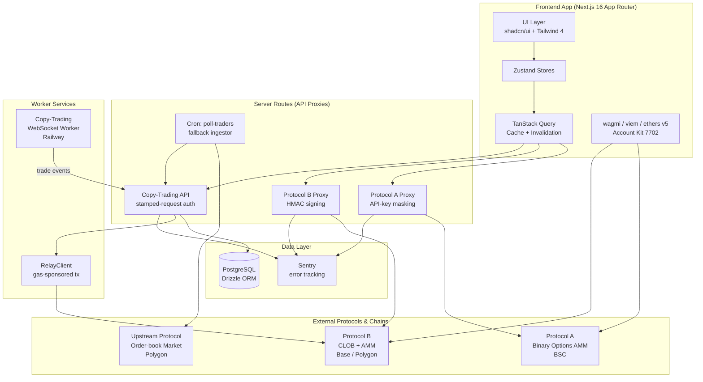

# Web3 Trading Integrations — Portfolio Showcase

> Note: commercial project developed for a web3 client under NDA. Source code is proprietary and not included here. This repository contains architectural documentation, design decisions, and anonymized highlights of work I shipped to production between March and April 2026.

## Table of Contents

- [Overview](#overview)
- [Scope Delivered](#scope-delivered)
- [Architecture at a Glance](#architecture-at-a-glance)
- [Technology Stack](#technology-stack)
- [Technical Highlights](#technical-highlights)
- [Security & Correctness Fixes](#security-fixes)
- [Observed Improvements](#observed-improvements)
- [Challenges & Solutions](#challenges--solutions)
- [Known Limitations](#known-limitations)
- [Stats](#stats)
- [Additional Documentation](#additional-documentation)
- [License](#license)
- [Contact](#contact)

---

## Overview

A production multi-platform prediction-market aggregator. Users trade binary/multi-outcome markets across several upstream protocols (on-chain AMM/CLOB hybrids, multi-chain collateral) from a single unified UI, with copy-trading, portfolio aggregation, and cross-chain deposit/withdraw flows.

My scope over ~2 months covered **three major integrations**, shipped end-to-end:

1. **Protocol A** — full integration of a BSC-based binary-options platform with on-chain trading, stablecoin auto-swap, candle-market observation windows, and cross-chain deposit.
2. **Protocol B** — full integration of a prediction-market platform with hybrid AMM + CLOB liquidity, HMAC-signed delegated trading, WebSocket live prices, limit orders, and multi-chain redeem.
3. **Copy-Trading System** — an upstream-WebSocket-driven copy-trading engine with FIFO-based PnL reconciliation, Safe-wallet auto-deployment on withdraw, and hardening against five production-grade security issues.

**Role:** Full-Stack Developer / Integration Engineer
**Status:** Production (Active, handling real on-chain positions)
**Period:** March–April 2026

---

## Scope Delivered

### Protocol A Integration (binary-options AMM on BSC)
- Typed API client + response normalizer to internal model
- Quote/trade/portfolio proxy routes (server-side API-key protection)
- Live price chart (polling + historical)
- **Candle markets** with 5-min observation rounds + Binance fallback feed
- On-chain trading hook (approval + calldata execution via Account Kit signer)
- Sell / close-position flow through quote API
- BNB Chain deposit & 7702-sponsored USDT withdraw
- USDT ↔ USD1 auto-swap via PancakeSwap V3 (collateral mismatch handling)
- Platform filter, portfolio integration, i18n, bridge config, unit tests

### Protocol B Integration (CLOB + AMM prediction market)
- Three evolutions of the auth layer:
  1. EOA direct trading with SIWE session
  2. SIWE with per-user session token + rate-limit guard (60s cooldown)
  3. **Final: HMAC + partner/delegated accounts with `x-on-behalf-of`** (session-less, rate-limit-resilient)
- CLOB submit, cancel, open-orders, and limit-order UI (price input, locked balance)
- **AMM** buy/sell with binary search for output amount computed against a cached pool state (falls back to a single on-chain verification call rather than polling per iteration)
- NegRisk sell-adapter approval for no-side exits
- WebSocket integration for live prices, orderbook, market lifecycle
- Redeem flow with on-chain payout, SYNCING state, tx-hash deduplication, revert detection
- Post-SELL/REDEEM polling + instant UI hide after close
- Portfolio integration (on-chain CTF positions), Explore filter, trade history
- Open orders aggregated across markets in portfolio
- Live Crypto page integration, sports leagues, group markets, oracle charts

### Copy-Trading System
- Dedicated per-follower wallet (Polygon Safe, 7702-enabled for gas sponsorship)
- Upstream trade-stream WebSocket worker (Railway-hosted, Dockerfile + heartbeat)
- Zombie-connection detection, reconnect backoff, idempotent enqueue
- **Fast-path trigger** — browser pings server after a trader's trade for ~3–5s copy (vs ~60s polling baseline)
- **FIFO PnL** with `actualSellValue` — correct across partial fills, redeem events, and cross-source (CLOB + AMM + on-chain balance delta)
- Poll-traders cron as fallback ingestor (uses Data API with Safe/proxy wallet, not EOA)
- Redeem button for resolved markets, REDEEM as SELL record for consistent PnL
- CT positions in portfolio total, exposure calculated from on-chain balances (not stale queue rows)
- Partial-fill aggregation, proportional sell, non-retriable error classification
- FundWallet security dialog, Safe auto-deployment on withdraw with 2-min timeout → 202

---

## Architecture at a Glance

See [ARCHITECTURE.md](./ARCHITECTURE.md) for the full breakdown.

---

## Technology Stack

### Frontend
- **Framework:** Next.js 16 (App Router, Server Components, Route Handlers)
- **Language:** TypeScript (strict mode, `import type`, no `any`)
- **UI:** React 19, Tailwind CSS 4, shadcn/ui (new-york style)
- **State:** Zustand (stores), TanStack Query (server cache + invalidation)
- **i18n:** next-intl (en / ko / zh)
- **Forms / Validation:** native + zod patterns
- **Linting:** Biome, Husky + lint-staged

### Web3
- **Clients:** wagmi, viem, ethers v5 (legacy calldata execution)
- **Account Abstraction:** Alchemy Account Kit (EIP-7702), gas-sponsored RelayClient
- **Smart Contracts interacted with:**
  - Conditional Token Framework (CTF) — balance-delta for on-chain position reconciliation
  - NegRisk adapter — approvals for no-side sell
  - Safe smart accounts — auto-deployment on first withdraw
  - PancakeSwap V3 — USDT ↔ USD1 swap path
  - ERC-20 allowance management (split-tx on approval errors)
- **Chains:** Base, Polygon, BNB Chain (BSC)
- **Wallet:** WalletConnect v2, SIWE sign-in

### Backend
- **Database:** PostgreSQL + Drizzle ORM (typed schema, migrations)
- **Error Tracking:** Sentry (`captureApiError` helper with category/tags)
- **Auth:** SIWE + stamped-request headers, HMAC signing for delegated trading
- **Workers:** Node WebSocket worker on Railway (Dockerfile, health checks, heartbeat)

---

## Technical Highlights

### 1. FIFO PnL reconciliation across three trade sources
Problem: a user's position value was reconstructed from three independent sources (CLOB fills, AMM binary-search quotes, raw on-chain balance delta). A naive `shares × current_price` inflated PnL when `SELL` volume exceeded the matched `BUY` queue head.

Solution: maintain a per-token FIFO queue of BUYs; on each SELL, match against the head and use `actualSellValue` (returned by CLOB execution, not the requested size) as the realized proceeds. For redeems, record as a SELL with `calculated_size = original_buy_cost` to keep Win Rate arithmetic consistent.

Trade-off accepted: on-chain `CTF.balanceOf` is canonical for *open* shares, DB trade history is canonical for *cost basis and PnL*. Drift between the two is flagged to Sentry rather than reconciled automatically — the user always sees the on-chain number.

See [TECHNICAL_HIGHLIGHTS.md](./TECHNICAL_HIGHLIGHTS.md#fifo-pnl) for details.

### 2. Protocol B auth migration — session → HMAC + delegated accounts
Problem: session-based auth hit aggressive per-user rate limits (cascading 429s under load) and required a fresh login per page refresh.

Solution: migrated to HMAC-signed requests with `x-on-behalf-of` header and partner/delegated accounts. Session-less — survives page refresh, doesn't trigger per-user SIWE cooldowns. Kept a 60s client-side cooldown guard on any residual SIWE path as a safety net.

Migration was done in three phases (SIWE + guards → HMAC partner accounts → on-chain CTF for reads) rather than a big-bang rewrite, so every intermediate step was revertible. See [LIMITLESS_INTEGRATION.md](./LIMITLESS_INTEGRATION.md).

### 3. Copy-trading latency: 60s poll → WebSocket + fast-path
Problem: the original copy-trading pipeline polled an upstream Data API every 60s, meaning a follower's copy trade lagged 30–60s behind the source.

Solution: built a Node WebSocket worker (Railway-hosted) that subscribes to the upstream's live trade stream, plus a browser-driven fast-path — after any trader's trade fires client-side, the follower's browser pings our server directly with the trade payload, skipping the round-trip through the upstream API.

Kept the 60s polling worker as a fallback ingestor (cron) for idempotency. All three ingestion paths deduplicate at the DB layer via `UNIQUE(follower_id, tx_hash)` — no application-level coordination needed.

See [COPY_TRADING_SYSTEM.md](./COPY_TRADING_SYSTEM.md).

### 4. AMM sell-output binary search — local simulation instead of on-chain polling
Problem: computing the exact sell amount for an AMM hybrid market naively binary-searched over 30+ sequential RPC calls.

Solution: pre-fetch the pool state once per session, then run the binary search locally using the on-chain AMM formula (reserves + fee math), committing to RPC only for the final quote verification. Maintained in lockstep with the on-chain contract via a unit test that asserts `simulateSellQuote(x) === contract.getSellQuote(x)` for 100 random inputs.

Mechanical effect: 30+ RPC calls per quote → 2 (pool state + final verification). Pool-state caching amortizes the first call across a session. Also added price enrichment to avoid transient "zero price" flashes during state transitions.

### 5. Just-closed position flash bug
Problem: after a successful SELL, a closed position would reappear for ~30s due to stale server cache returning pre-trade data.

Solution: post-trade polling module that invalidates + refetches with backoff until the server state reflects the trade, combined with an optimistic hide on the trading-widget side (local set of `just_closed` token IDs, cleared after reconciliation).

Extracted into a shared module reused for both SELL and REDEEM.

### 6. Concurrent position close — nonce collision guard
Problem: clicking "Close" on two positions in rapid succession occasionally produced a silent nonce collision on the Account Kit smart-wallet layer, leaving one tx pending indefinitely.

Solution: per-user mutex on `closePosition` at the hook level (not the tx layer — so spinner state stays correct), plus a fail-closed RPC fallback if the primary RPC drops. Second click surfaces a toast ("another position is currently closing, please wait") instead of silently failing.

---

## Security & Correctness Fixes

Five production-grade issues identified and fixed during the engagement (severity ranges from Critical down to Low; see [SECURITY_HIGHLIGHTS.md](./SECURITY_HIGHLIGHTS.md) for severity-by-fix):

1. **Private-key scope leak** — a signing helper was closing over a key in a way that kept it alive in module scope longer than necessary. Re-scoped to per-invocation, fetched from secret store on each call.
2. **Unauthenticated enqueue endpoint** — the copy-trading enqueue route accepted any caller with a known `INTERNAL_API_SECRET` (which had leaked into a client bundle for dev debugging). Rotated the secret, removed it entirely, made the endpoint cron-only with `x-vercel-cron-signature` verification. Separate fast-path endpoint requires stamped-request auth, rate-limited.
3. **Stamped-request auth broken by body consumption** — create/edit relationship endpoints called `request.json()` before `resolveUser`, consuming the stream so the auth helper couldn't re-read the body and returned 401. Fixed by resolving the user before body parse (`resolveUserWithBody` reads once, caches, returns both).
4. **EOA lookup case-sensitivity** — withdraw endpoint looked up users by EOA address case-sensitively, missing all checksummed rows (silent 401). Normalized to lowercase at both insert and query boundary, plus a one-time migration to lowercase existing rows.
5. **FOK fill success without `orderID`** — upstream occasionally returned `{status: "ok", fills: [...]}` without an `orderID`. Our retry classification treated this as a transient failure and re-enqueued the already-filled trade. Classified as non-retriable + log full response to Sentry so upstream-shape drift surfaces immediately.

---

## Observed Improvements

Qualitative summary of changes shipped during the engagement. Exact before/after wall-clock figures aren't published here (the internal monitoring I used is not accessible post-engagement), but the mechanical changes are verifiable:

- **Copy-trading latency** — previously bounded by a 60s polling cron. After the WebSocket worker + browser fast-path, primary path is WS-driven (single-digit seconds), with the 60s cron kept as a fallback ingestor.
- **HMAC migration** — removed the recurring 429-cascade class of incidents on position-fetch that had been a daily support topic under the session-based auth.
- **AMM sell quote** — 30+ RPC calls per quote → 2 (pool state prefetch + final verification), with pool state cached per session.
- **Orderbook polling** — 1s poll replaced by WS-driven updates (30s fallback poll), roughly 95% fewer background requests for this resource.
- **Live-crypto cold start** — reorganized into a 2-phase fetch so market tiles render before background data populates side panels, instead of waiting for the full serial chain to complete.

---

## Challenges & Solutions

### Cross-source PnL attribution
With CLOB fills, AMM quotes, and raw on-chain balance deltas all contributing to a user's position, a single source-of-truth for "current shares" doesn't exist. Solved by treating the on-chain CTF balance as canonical for **open** shares, and a FIFO queue of trade events as canonical for **PnL history**. Reconciled on every render via a shared module.

### Cross-chain collateral (USDT vs USD1)
Protocol A uses USD1 collateral on BSC. Users deposit USDT (canonical). Implemented an auto-swap path through PancakeSwap V3 on redeem/sell, with a fallback error-handling flow if the swap fails (treat as non-retriable, surface friendly message).

### Dust positions
Sub-0.05 share positions on Protocol B cluttered the dashboard and broke PnL percentage math. Filtered below-threshold positions in the portfolio view, added hide/unhide with localStorage persistence.

### Market-resolution race
When a market resolves mid-session, the WebSocket fires `marketResolved` but the REST response may still report the market as open for several seconds. Patched the client cache on WS event with the `winningOutcomeIndex` to ensure consistent rendering.

### Pagination overflow in Protocol A portfolio
API pagination silently dropped positions past page 8. Paged through all 10 pages, added weekly-markets capture on pages 9-10, and filtered esports category leaks from the crypto tile.

---

## Known Limitations

Honest list of things I'd like to fix or would call out to a reviewer:

- **Copy-trading WS worker is a single point of failure.** If Railway drops, ingestion falls back to the 60s polling cron (degraded latency, not data loss). Running two workers would need cross-worker dedup — tracked as a backlog item.
- **No backfill on relationship creation.** When a user adds a new trader, we don't replay pre-existing trades. Product decision was "by design" (follower opts in from this moment forward), not a constraint of the system.
- **`x-on-behalf-of` migration backlog.** Portfolio fetches still use a 409-fallback pattern rather than unified `x-on-behalf-of` everywhere — cleaner, non-urgent, tracked.
- **Cross-source trades not attributed.** If a user trades on the native platform UI directly, we see the on-chain balance delta but no cost basis — the position surfaces correctly but its PnL is an estimate from the midpoint at first sighting.
- **Each follower uses a dedicated Safe; manual trading on the same Safe can race with copy trades.** Recommended UX keeps manual trading on the primary wallet. Not enforced in code.

---

## Stats

- Duration: ~2 months (March–April 2026)
- Commits: 331
- Integrations shipped: 3 (Protocol A, Protocol B, Copy-Trading System)
- Chains: Base, Polygon, BSC
- Security & correctness fixes: 5

---

## Additional Documentation

- [ARCHITECTURE.md](./ARCHITECTURE.md) — system architecture, data flow, module boundaries
- [TECHNICAL_HIGHLIGHTS.md](./TECHNICAL_HIGHLIGHTS.md) — deep-dives on FIFO PnL, HMAC auth, binary search, WS worker, post-trade polling
- [MYRIAD_INTEGRATION.md](./MYRIAD_INTEGRATION.md) — Protocol A integration (full scope)
- [LIMITLESS_INTEGRATION.md](./LIMITLESS_INTEGRATION.md) — Protocol B integration (full scope)
- [COPY_TRADING_SYSTEM.md](./COPY_TRADING_SYSTEM.md) — WS worker, FIFO PnL, fast-path
- [SECURITY_HIGHLIGHTS.md](./SECURITY_HIGHLIGHTS.md) — 5 security & correctness fix writeups

---

## License

Documentation in this repository is released under Creative Commons Attribution-NonCommercial 4.0 (CC BY-NC 4.0). Source code of the product itself is proprietary and not included here.

---

## Contact

Open to web3 frontend / full-stack integration roles (remote, B2B preferred).

- GitHub: [github.com/paradoxlabdev](https://github.com/paradoxlabdev)
- LinkedIn: _(to be added)_
- Email: _(on request via GitHub)_

---

*Last updated: April 2026*
