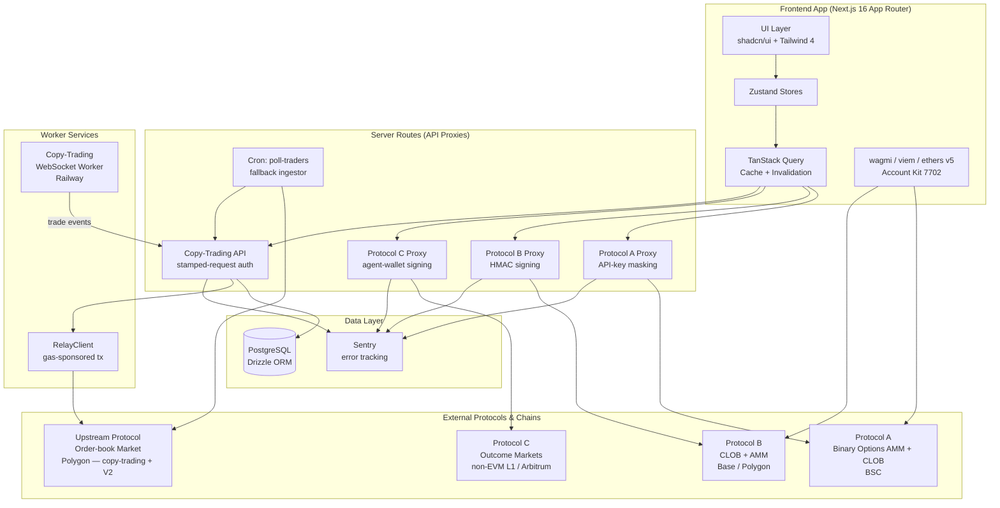

# Web3 Trading Integrations — Portfolio Showcase

> Note: commercial project developed for a web3 client under NDA. Source code is proprietary and not included here. This repository contains architectural documentation, design decisions, and anonymized highlights of work I shipped to production between March and June 2026.

## Table of Contents

- [Overview](#overview)
- [Scope Delivered](#scope-delivered)
- [Architecture at a Glance](#architecture-at-a-glance)
- [Technology Stack](#technology-stack)
- [Technical Highlights](#technical-highlights)
- [Security & Correctness Fixes](#security-fixes)
- [Observed Improvements](#observed-improvements)
- [Challenges & Solutions](#challenges--solutions)
- [Known Limitations](#known-limitations)
- [Stats](#stats)
- [Additional Documentation](#additional-documentation)
- [License](#license)
- [Contact](#contact)

---

## Overview

A production multi-platform prediction-market aggregator. Users trade binary/multi-outcome markets across several upstream protocols (on-chain AMM/CLOB hybrids, multi-chain collateral) from a single unified UI, with copy-trading, portfolio aggregation, and cross-chain deposit/withdraw flows.

My scope over ~4 months covered **three protocol integrations plus a copy-trading system**, shipped end-to-end:

1. **Protocol A** — full integration of a BSC-based binary-options platform with on-chain trading, stablecoin auto-swap, candle-market observation windows, and cross-chain deposit. Later extended with a **CLOB order-book** path (EIP-1271 smart-wallet signing + swap-on-trade collateral).
2. **Protocol B** — full integration of a prediction-market platform with hybrid AMM + CLOB liquidity, HMAC-signed delegated trading, WebSocket live prices, limit orders, and multi-chain redeem.
3. **Protocol C** — full integration of an outcome-market venue on a **non-EVM high-performance L1**: an agent-wallet signing model (silent server-side order signing, user-signed withdrawals), a WebSocket orderbook engineered to fit a strict 1200-weight/min rate budget, a watched cross-chain deposit/auto-fund pipeline, and a three-stage withdraw with double-withdraw protection.
4. **Copy-Trading System** — an upstream-WebSocket-driven copy-trading engine with FIFO-based PnL reconciliation, Safe-wallet auto-deployment on withdraw, and hardening against multiple production-grade security issues. Later carried the follower wallets through the upstream's hard **V2 protocol cutover** — new SDK, **pUSD** collateral, per-order builder attribution, and a Safe→deposit-wallet custody migration that recovered live follower funds stranded by the change.

**Role:** Full-Stack Developer / Integration Engineer
**Status:** Production (Active, handling real on-chain positions)
**Period:** March–June 2026

---

## Scope Delivered

### Protocol A Integration (binary-options AMM on BSC)
- Typed API client + response normalizer to internal model
- Quote/trade/portfolio proxy routes (server-side API-key protection)
- Live price chart (polling + historical)
- **Candle markets** with 5-min observation rounds + Binance fallback feed
- On-chain trading hook (approval + calldata execution via Account Kit signer)
- Sell / close-position flow through quote API
- BNB Chain deposit & 7702-sponsored USDT withdraw
- USDT ↔ USD1 auto-swap via PancakeSwap V3 (collateral mismatch handling)
- Platform filter, portfolio integration, i18n, bridge config, unit tests

### Protocol A — CLOB Evolution (added later)
- Order-book trading path alongside the original AMM, behind one unified panel
- **EIP-1271** smart-contract-wallet order signing (typed-data domain transcribed from protocol docs, not API)
- Swap-on-trade collateral: ensure USD1 before BUY, sweep USD1 → USDT after fill
- `pollAndSwapBackOnFill` sweep-back with 5 unit-tested invariants (5 prod bugs traced through it in one week)
- 18-decimal uint256 wire format; stranded-USD1 recovery banner; pre-deploy schema-drift smoke test
- See [MYRIAD_INTEGRATION.md → CLOB Evolution](./MYRIAD_INTEGRATION.md#clob-evolution)

### Protocol B Integration (CLOB + AMM prediction market)
- Three evolutions of the auth layer:
  1. EOA direct trading with SIWE session
  2. SIWE with per-user session token + rate-limit guard (60s cooldown)
  3. **Final: HMAC + partner/delegated accounts with `x-on-behalf-of`** (session-less, rate-limit-resilient)
- CLOB submit, cancel, open-orders, and limit-order UI (price input, locked balance)
- **AMM** buy/sell with binary search for output amount computed against a cached pool state (falls back to a single on-chain verification call rather than polling per iteration)
- NegRisk sell-adapter approval for no-side exits
- WebSocket integration for live prices, orderbook, market lifecycle
- Redeem flow with on-chain payout, SYNCING state, tx-hash deduplication, revert detection
- Post-SELL/REDEEM polling + instant UI hide after close
- Portfolio integration (on-chain CTF positions), Explore filter, trade history
- Open orders aggregated across markets in portfolio
- Live Crypto page integration, sports leagues, group markets, oracle charts
- Recurring **crypto-binary (Up/Down)** markets (5min–daily cadence) with auto-rolling rounds, Chainlink OHLCV candle chart, and a new `oraclePriceData` WS stream

### Protocol C Integration (outcome markets on a non-EVM L1)
- `Platform` union + Explore filter + i18n (`hyperliquid.*`); single-env-var testnet switch for the whole stack
- Typed client + ~250-LOC normalizer (event/market mapping, custom side-name extraction, settled-position display cache)
- **18 server proxy routes** (balance, positions, open-orders, fills, orderbook, candles, order, cancel, agent init/confirm, transfer init/confirm, withdraw init/confirm, two collateral-conversion routes), all stamped-request authenticated
- **Agent-wallet signing model**: one-time `ApproveAgent`, then silent server-side order signing; withdrawals stay user-signed (agents can't pull funds); agent key encrypted at rest with AES-256-GCM bound to userId via AAD
- L1-action order signing (msgpack + keccak actionHash + EIP-712 phantom domain), per-request nonce generation
- **WebSocket orderbook** (singleton, refcounted subs, heartbeat zombie-detection, jittered reconnect) engineered to fit a **1200 weight/min per-IP** budget — read load cut ~450 → ~108 weight/min/user
- Watched Arbitrum→L1 deposit + perp→spot auto-fund, with cross-tab locks and paymaster-retry/silent-success handling
- Three-stage withdraw (USDH→USDC convert → perp→spot → user-signed `withdraw3`) with pessimistic double-withdraw flag and a corrected practical-max calc
- Platform-native decimal pricing (0.3250, not ¢32.50); real outcome side names + per-side chart; fallback-outcome hiding
- See [HYPERLIQUID_INTEGRATION.md](./HYPERLIQUID_INTEGRATION.md)

### Copy-Trading System
- Dedicated per-follower wallet (Polygon Safe, 7702-enabled for gas sponsorship)
- Upstream trade-stream WebSocket worker (Railway-hosted, Dockerfile + heartbeat)
- Zombie-connection detection, reconnect backoff, idempotent enqueue
- **Fast-path trigger** — browser pings server after a trader's trade for ~3–5s copy (vs ~60s polling baseline)
- **FIFO PnL** with `actualSellValue` — correct across partial fills, redeem events, and cross-source (CLOB + AMM + on-chain balance delta)
- Poll-traders cron as fallback ingestor (uses Data API with Safe/proxy wallet, not EOA)
- Redeem button for resolved markets, REDEEM as SELL record for consistent PnL
- CT positions in portfolio total, exposure calculated from on-chain balances (not stale queue rows)
- Partial-fill aggregation, proportional sell, non-retriable error classification
- FundWallet security dialog, Safe auto-deployment on withdraw with 2-min timeout → 202
- **Carried the follower wallets through the upstream's fixed-date V2 cutover**: new CLOB SDK, pUSD collateral (wrapped from USDC.e), per-order signed `builderCode` attribution, new V2 contract set
- Hot-swap endpoint strategy (stable proxy URL → repoint upstream at cutover, no app redeploy)
- Follower-wallet custody migration (per-user Safe → deterministic deposit wallet) with guarded, sweep-only `/portfolio` recovery banners
- Fixed three cutover-surfaced bugs where UI and server resolved different funder wallets — orphan-Safe drain, a deposit-wallet bridge that never bridged, and EOA-stranded-pUSD rescue
- See [COPY_TRADING_SYSTEM.md → Wallet-Custody Migration](./COPY_TRADING_SYSTEM.md#wallet-custody-migration)

---

## Architecture at a Glance

```mermaid
graph TB
    subgraph "External Protocols & Chains"
        PA[Protocol A<br/>Binary Options AMM + CLOB<br/>BSC]
        PB[Protocol B<br/>CLOB + AMM<br/>Base / Polygon]
        PC[Protocol C<br/>Outcome Markets<br/>non-EVM L1 / Arbitrum]
        PD[Upstream Protocol<br/>Order-book Market<br/>Polygon — copy-trading + V2]
    end

    subgraph "Frontend App (Next.js 16 App Router)"
        UI[UI Layer<br/>shadcn/ui + Tailwind 4]
        STORES[Zustand Stores]
        Q[TanStack Query<br/>Cache + Invalidation]
        WEB3[wagmi / viem / ethers v5<br/>Account Kit 7702]
    end

    subgraph "Server Routes (API Proxies)"
        R_A[Protocol A Proxy<br/>API-key masking]
        R_B[Protocol B Proxy<br/>HMAC signing]
        R_C[Protocol C Proxy<br/>agent-wallet signing]
        R_CT[Copy-Trading API<br/>stamped-request auth]
        R_CRON[Cron: poll-traders<br/>fallback ingestor]
    end

    subgraph "Data Layer"
        PG[(PostgreSQL<br/>Drizzle ORM)]
        SENTRY[Sentry<br/>error tracking]
    end

    subgraph "Worker Services"
        WS_WORKER[Copy-Trading<br/>WebSocket Worker<br/>Railway]
        RELAY[RelayClient<br/>gas-sponsored tx]
    end

    UI --> STORES
    STORES --> Q
    Q --> R_A
    Q --> R_B
    Q --> R_C
    Q --> R_CT
    R_A --> PA
    R_B --> PB
    R_C --> PC
    WS_WORKER -->|trade events| R_CT
    R_CT --> PG
    R_CRON --> PD
    R_CRON --> R_CT
    WEB3 --> PA
    WEB3 --> PB
    R_CT --> RELAY
    RELAY --> PD
    R_A --> SENTRY
    R_B --> SENTRY
    R_C --> SENTRY
    R_CT --> SENTRY
```

See [ARCHITECTURE.md](./ARCHITECTURE.md) for the full breakdown.

---

## Technology Stack

### Frontend
- **Framework:** Next.js 16 (App Router, Server Components, Route Handlers)
- **Language:** TypeScript (strict mode, `import type`, no `any`)
- **UI:** React 19, Tailwind CSS 4, shadcn/ui (new-york style)
- **State:** Zustand (stores), TanStack Query (server cache + invalidation)
- **i18n:** next-intl (en / ko / zh)
- **Forms / Validation:** native + zod patterns
- **Linting:** Biome, Husky + lint-staged

### Web3
- **Clients:** wagmi, viem, ethers v5 (legacy calldata execution)
- **Account Abstraction:** Alchemy Account Kit (EIP-7702), gas-sponsored RelayClient
- **Smart Contracts interacted with:**
  - Conditional Token Framework (CTF) — balance-delta for on-chain position reconciliation
  - NegRisk adapter — approvals for no-side sell
  - Safe smart accounts — auto-deployment on first withdraw; custody-migration drain (V2)
  - Collateral onramp — USDC.e → pUSD wrap (copy-trading upstream V2)
  - PancakeSwap V3 — USDT ↔ USD1 swap path
  - ERC-20 allowance management (split-tx on approval errors)
- **Signing models:** EOA (wagmi), Account Kit smart wallet (AA), **EIP-1271** smart-contract-wallet order signing (Protocol A CLOB), **agent-wallet** off-chain L1-action signing with AES-256-GCM key custody (Protocol C)
- **Non-EVM:** Protocol C is a non-EVM L1 traded via signed REST actions + WebSocket (msgpack + keccak action hash + EIP-712 phantom domain), no calldata/gas
- **Chains:** Base, Polygon, BNB Chain (BSC), Arbitrum (+ Protocol C's own L1)
- **Wallet:** WalletConnect v2, SIWE sign-in

### Backend
- **Database:** PostgreSQL + Drizzle ORM (typed schema, migrations)
- **Error Tracking:** Sentry (`captureApiError` helper with category/tags)
- **Auth:** SIWE + stamped-request headers, HMAC signing for delegated trading
- **Workers:** Node WebSocket worker on Railway (Dockerfile, health checks, heartbeat)

---

## Technical Highlights

### 1. FIFO PnL reconciliation across three trade sources
Problem: a user's position value was reconstructed from three independent sources (CLOB fills, AMM binary-search quotes, raw on-chain balance delta). A naive `shares × current_price` inflated PnL when `SELL` volume exceeded the matched `BUY` queue head.

Solution: maintain a per-token FIFO queue of BUYs; on each SELL, match against the head and use `actualSellValue` (returned by CLOB execution, not the requested size) as the realized proceeds. For redeems, record as a SELL with `calculated_size = original_buy_cost` to keep Win Rate arithmetic consistent.

Trade-off accepted: on-chain `CTF.balanceOf` is canonical for *open* shares, DB trade history is canonical for *cost basis and PnL*. Drift between the two is flagged to Sentry rather than reconciled automatically — the user always sees the on-chain number.

See [TECHNICAL_HIGHLIGHTS.md](./TECHNICAL_HIGHLIGHTS.md#fifo-pnl) for details.

### 2. Protocol B auth migration — session → HMAC + delegated accounts
Problem: session-based auth hit aggressive per-user rate limits (cascading 429s under load) and required a fresh login per page refresh.

Solution: migrated to HMAC-signed requests with `x-on-behalf-of` header and partner/delegated accounts. Session-less — survives page refresh, doesn't trigger per-user SIWE cooldowns. Kept a 60s client-side cooldown guard on any residual SIWE path as a safety net.

Migration was done in three phases (SIWE + guards → HMAC partner accounts → on-chain CTF for reads) rather than a big-bang rewrite, so every intermediate step was revertible. See [LIMITLESS_INTEGRATION.md](./LIMITLESS_INTEGRATION.md).

### 3. Copy-trading latency: 60s poll → WebSocket + fast-path
Problem: the original copy-trading pipeline polled an upstream Data API every 60s, meaning a follower's copy trade lagged 30–60s behind the source.

Solution: built a Node WebSocket worker (Railway-hosted) that subscribes to the upstream's live trade stream, plus a browser-driven fast-path — after any trader's trade fires client-side, the follower's browser pings our server directly with the trade payload, skipping the round-trip through the upstream API.

Kept the 60s polling worker as a fallback ingestor (cron) for idempotency. All three ingestion paths deduplicate at the DB layer via `UNIQUE(follower_id, tx_hash)` — no application-level coordination needed.

See [COPY_TRADING_SYSTEM.md](./COPY_TRADING_SYSTEM.md).

### 4. AMM sell-output binary search — local simulation instead of on-chain polling
Problem: computing the exact sell amount for an AMM hybrid market naively binary-searched over 30+ sequential RPC calls.

Solution: pre-fetch the pool state once per session, then run the binary search locally using the on-chain AMM formula (reserves + fee math), committing to RPC only for the final quote verification. Maintained in lockstep with the on-chain contract via a unit test that asserts `simulateSellQuote(x) === contract.getSellQuote(x)` for 100 random inputs.

Mechanical effect: 30+ RPC calls per quote → 2 (pool state + final verification). Pool-state caching amortizes the first call across a session. Also added price enrichment to avoid transient "zero price" flashes during state transitions.

### 5. Just-closed position flash bug
Problem: after a successful SELL, a closed position would reappear for ~30s due to stale server cache returning pre-trade data.

Solution: post-trade polling module that invalidates + refetches with backoff until the server state reflects the trade, combined with an optimistic hide on the trading-widget side (local set of `just_closed` token IDs, cleared after reconciliation).

Extracted into a shared module reused for both SELL and REDEEM.

### 6. Concurrent position close — nonce collision guard
Problem: clicking "Close" on two positions in rapid succession occasionally produced a silent nonce collision on the Account Kit smart-wallet layer, leaving one tx pending indefinitely.

Solution: per-user mutex on `closePosition` at the hook level (not the tx layer — so spinner state stays correct), plus a fail-closed RPC fallback if the primary RPC drops. Second click surfaces a toast ("another position is currently closing, please wait") instead of silently failing.

### 7. Fitting a WebSocket orderbook into a hard rate budget (Protocol C)
Problem: the venue rate-limits at **1200 weight/min per IP** — and because all users on a server share that IP, the budget is per-server, not per-user. The naive all-polling read layer burned ~450 weight/min per user, so two concurrent users saturated the budget and a third triggered cascading 429s for everyone.

Solution: moved the heaviest, most latency-sensitive resource (the orderbook) to a singleton WebSocket with refcounted subscriptions and heartbeat-based zombie detection, then relaxed every remaining poll to the slowest interval each surface tolerates. Read load dropped ~450 → ~108 weight/min per user — from ~2–3 concurrent users per IP to ~11.

See [HYPERLIQUID_INTEGRATION.md → WebSocket & the Weight Budget](./HYPERLIQUID_INTEGRATION.md#websocket--the-weight-budget).

### 8. Agent-wallet signing + double-withdraw protection (Protocol C)
Problem: a non-EVM venue can't pop a wallet on every order, but signing every trade with a server-held key must not let the server move user funds. Separately, if a withdraw request reaches the venue but its response is lost (network drop), a naive retry issues a *second* withdrawal.

Solution: an **agent-wallet** model — the user approves a dedicated agent key once (EIP-712), orders are then signed silently server-side, but withdrawals stay **user-signed** (agents can place/cancel orders, never pull funds). The agent key is encrypted at rest with AES-256-GCM bound to the userId via AAD, so a row copied to another user fails to decrypt. Double-withdraw is closed with a **pessimistic localStorage flag set before the POST, not after** — cleared on an explicit error (venue rejected it), kept on a network error (venue state unknown), auto-expiring after 5 min.

See [HYPERLIQUID_INTEGRATION.md → Agent-Wallet Signing Model](./HYPERLIQUID_INTEGRATION.md#agent-wallet-signing-model).

### 9. Carrying copy-trading wallets through a fixed-date upstream V2 cutover
Problem: the platform copy-trading executes on announced a hard V2 cutover on a fixed calendar date — new SDK, new collateral (pUSD), new order schema, and a follower-wallet custody change (Safe → deposit wallet) — all flipping at once, with live follower funds in flight under the old model.

Solution: a hot-swap endpoint strategy (point the SDK at a stable proxy, repoint the upstream at cutover with no app redeploy) plus guarded, sweep-only `/portfolio` recovery banners for the custody migration. The custody change's failure mode wasn't lost money — it was *invisible* money (UI and server resolving different funder wallets); the fix realigned the two resolvers and gave followers one-click recovery for anything already stranded.

See [COPY_TRADING_SYSTEM.md → Wallet-Custody Migration](./COPY_TRADING_SYSTEM.md#wallet-custody-migration).

---

## Security & Correctness Fixes

Production-grade issues identified and fixed during the engagement (severity ranges from Critical down to Low; see [SECURITY_HIGHLIGHTS.md](./SECURITY_HIGHLIGHTS.md) for severity-by-fix). The first five came out of the copy-trading and Protocol A/B work; the last three out of Protocol C/D:

1. **Private-key scope leak** — a signing helper was closing over a key in a way that kept it alive in module scope longer than necessary. Re-scoped to per-invocation, fetched from secret store on each call.
2. **Unauthenticated enqueue endpoint** — the copy-trading enqueue route accepted any caller with a known `INTERNAL_API_SECRET` (which had leaked into a client bundle for dev debugging). Rotated the secret, removed it entirely, made the endpoint cron-only with `x-vercel-cron-signature` verification. Separate fast-path endpoint requires stamped-request auth, rate-limited.
3. **Stamped-request auth broken by body consumption** — create/edit relationship endpoints called `request.json()` before `resolveUser`, consuming the stream so the auth helper couldn't re-read the body and returned 401. Fixed by resolving the user before body parse (`resolveUserWithBody` reads once, caches, returns both).
4. **EOA lookup case-sensitivity** — withdraw endpoint looked up users by EOA address case-sensitively, missing all checksummed rows (silent 401). Normalized to lowercase at both insert and query boundary, plus a one-time migration to lowercase existing rows.
5. **FOK fill success without `orderID`** — upstream occasionally returned `{status: "ok", fills: [...]}` without an `orderID`. Our retry classification treated this as a transient failure and re-enqueued the already-filled trade. Classified as non-retriable + log full response to Sentry so upstream-shape drift surfaces immediately.
6. **Bridge over-sweep on withdraw recovery (Protocol C)** — the stranded-balance recovery path bridged the *full* live source-chain balance instead of the expected withdraw amount, sweeping pre-existing funds the user hadn't asked to move ($50 idle + $100 withdraw = $150 bridged). Capped the bridge amount at `min(liveBalance, expectedAmount)` and persisted the expected amount for the recovery path.
7. **Double-withdraw on lost response (Protocol C)** — if `/confirm` reached the venue but its response was lost, a retry with a fresh nonce issued a second withdrawal. Closed with a pessimistic flag set *before* the POST: cleared on explicit 4xx/5xx (venue rejected, retry safe), kept on network error (venue state unknown), 5-min auto-expiry.
8. **Agent-key cross-user decryption (Protocol C)** — agent private keys were encrypted at rest but not bound to their owner, so a DB-level row swap could let user B sign as user A. Bound each ciphertext to its userId via AES-256-GCM AAD, so a swapped row fails the auth-tag check on decrypt; backwards-compatible decrypt + key-rotation support added in the same pass.

---

## Observed Improvements

Qualitative summary of changes shipped during the engagement. Exact before/after wall-clock figures aren't published here (the internal monitoring I used is not accessible post-engagement), but the mechanical changes are verifiable:

- **Copy-trading latency** — previously bounded by a 60s polling cron. After the WebSocket worker + browser fast-path, primary path is WS-driven (single-digit seconds), with the 60s cron kept as a fallback ingestor.
- **HMAC migration** — removed the recurring 429-cascade class of incidents on position-fetch that had been a daily support topic under the session-based auth.
- **AMM sell quote** — 30+ RPC calls per quote → 2 (pool state prefetch + final verification), with pool state cached per session.
- **Orderbook polling** — 1s poll replaced by WS-driven updates (30s fallback poll), roughly 95% fewer background requests for this resource.
- **Protocol C read budget** — the all-polling read layer (~450 weight/min per user) was re-architected around a WebSocket orderbook + relaxed polls to ~108 weight/min per user, raising the per-server-IP concurrency ceiling from ~2–3 users to ~11 before hitting the venue's 1200 weight/min limit.
- **Copy-trading V2 cutover** — carried the follower wallets through a fixed-date upstream cutover with no app-redeploy downtime (hot-swap behind a stable proxy URL), and recovered live follower funds that the custody change had stranded invisibly.
- **Live-crypto cold start** — reorganized into a 2-phase fetch so market tiles render before background data populates side panels, instead of waiting for the full serial chain to complete.

---

## Challenges & Solutions

### Cross-source PnL attribution
With CLOB fills, AMM quotes, and raw on-chain balance deltas all contributing to a user's position, a single source-of-truth for "current shares" doesn't exist. Solved by treating the on-chain CTF balance as canonical for **open** shares, and a FIFO queue of trade events as canonical for **PnL history**. Reconciled on every render via a shared module.

### Cross-chain collateral (USDT vs USD1)
Protocol A uses USD1 collateral on BSC. Users deposit USDT (canonical). Implemented an auto-swap path through PancakeSwap V3 on redeem/sell, with a fallback error-handling flow if the swap fails (treat as non-retriable, surface friendly message).

### Dust positions
Sub-0.05 share positions on Protocol B cluttered the dashboard and broke PnL percentage math. Filtered below-threshold positions in the portfolio view, added hide/unhide with localStorage persistence.

### Market-resolution race
When a market resolves mid-session, the WebSocket fires `marketResolved` but the REST response may still report the market as open for several seconds. Patched the client cache on WS event with the `winningOutcomeIndex` to ensure consistent rendering.

### Pagination overflow in Protocol A portfolio
API pagination silently dropped positions past page 8. Paged through all 10 pages, added weekly-markets capture on pages 9-10, and filtered esports category leaks from the crypto tile.

---

## Known Limitations

Honest list of things I'd like to fix or would call out to a reviewer:

- **Copy-trading WS worker is a single point of failure.** If Railway drops, ingestion falls back to the 60s polling cron (degraded latency, not data loss). Running two workers would need cross-worker dedup — tracked as a backlog item.
- **No backfill on relationship creation.** When a user adds a new trader, we don't replay pre-existing trades. Product decision was "by design" (follower opts in from this moment forward), not a constraint of the system.
- **`x-on-behalf-of` migration backlog.** Portfolio fetches still use a 409-fallback pattern rather than unified `x-on-behalf-of` everywhere — cleaner, non-urgent, tracked.
- **Cross-source trades not attributed.** If a user trades on the native platform UI directly, we see the on-chain balance delta but no cost basis — the position surfaces correctly but its PnL is an estimate from the midpoint at first sighting.
- **Each follower uses a dedicated Safe; manual trading on the same Safe can race with copy trades.** Recommended UX keeps manual trading on the primary wallet. Not enforced in code.
- **Protocol C agent-wallet model trusts the server with the agent key.** The boundary is correct (agents can't withdraw — withdrawals stay user-signed), but a server compromise could place/cancel orders. A fuller fix pushes agent-key custody to a KMS/HSM.
- **Protocol C weight budget is per-server-IP (~11 concurrent users).** Beyond that, scaling needs more IPs or a shared subscription proxy — tracked, not yet required at current load.
- **Protocol C sub-$10 positions/dust are stuck.** The venue's $10 spot order minimum (and no reduce-only on spot) means a sub-$10 position can't be sold and sub-$10 collateral dust can't be withdrawn until it batches up or the market resolves. Surfaced in the UI rather than hidden.
- **Copy-trading wallets still have two funder-address resolvers (client + server).** Realigned after the orphan-Safe bug during the upstream V2 cutover, but a single shared resolver would be the robust fix; recovery banners are reactive, not preventive.

---

## Stats

- Duration: ~4 months (March–June 2026)
- Commits: 600+ (integration work)
- Integrations shipped: 3 protocols (A / B / C) + Copy-Trading System (incl. upstream V2 cutover migration)
- Chains: Base, Polygon, BSC, Arbitrum (+ Protocol C's non-EVM L1)
- Signing models: EOA, Account Kit AA, EIP-1271, agent-wallet (off-chain L1 actions)
- Security & correctness fixes: 8

---

## Additional Documentation

- [ARCHITECTURE.md](./ARCHITECTURE.md) — system architecture, data flow, module boundaries
- [TECHNICAL_HIGHLIGHTS.md](./TECHNICAL_HIGHLIGHTS.md) — deep-dives on FIFO PnL, HMAC auth, binary search, WS worker, post-trade polling
- [MYRIAD_INTEGRATION.md](./MYRIAD_INTEGRATION.md) — Protocol A integration (AMM + CLOB evolution)
- [LIMITLESS_INTEGRATION.md](./LIMITLESS_INTEGRATION.md) — Protocol B integration (full scope)
- [HYPERLIQUID_INTEGRATION.md](./HYPERLIQUID_INTEGRATION.md) — Protocol C integration (agent wallets, weight budget, deposit/withdraw)
- [COPY_TRADING_SYSTEM.md](./COPY_TRADING_SYSTEM.md) — WS worker, FIFO PnL, fast-path, + upstream V2 cutover wallet migration
- [SECURITY_HIGHLIGHTS.md](./SECURITY_HIGHLIGHTS.md) — security & correctness fix writeups

---

## License

Documentation in this repository is released under Creative Commons Attribution-NonCommercial 4.0 (CC BY-NC 4.0). Source code of the product itself is proprietary and not included here.

---

## Contact

Open to web3 frontend / full-stack integration roles (remote, B2B preferred).

- GitHub: [github.com/paradoxlabdev](https://github.com/paradoxlabdev)
- LinkedIn: _(to be added)_
- Email: _(on request via GitHub)_

---

*Last updated: June 2026*
